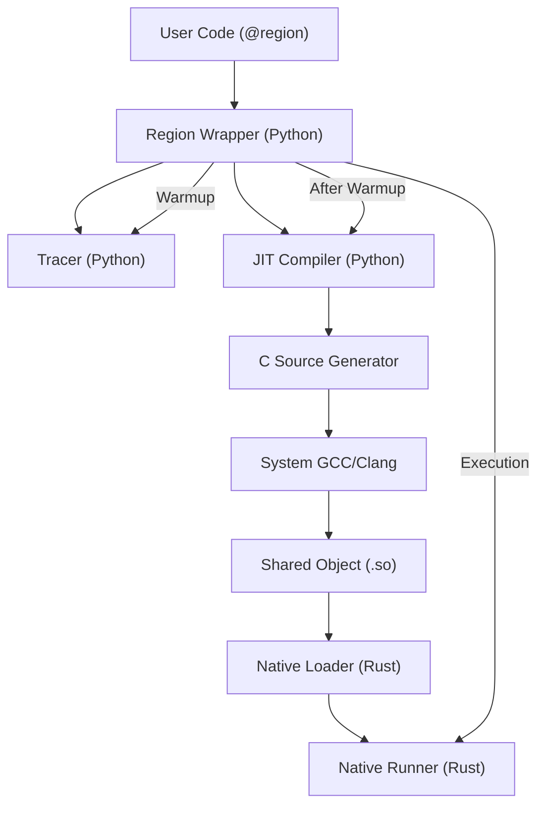

# PyAOT Architecture

## Overview

PyAOT's **Region Accelerator** optimizes Python execution by identifying hot, side-effect-free "regions" of code and compiling them to native C code, which is then compiled to a shared object and executed via a Rust-based runner.

## Core Hypothesis

Pure numeric or logic-heavy Python code suffers from interpreter overhead (type dispatch, boxing/unboxing). By observing runtime types and compiling a specialized native version, we can eliminate this overhead, provided the native execution time significantly exceeds the cost of the FFI boundary transition.

## System Components

### 1. The Region Wrapper (`pyaot/region/wrapper.py`)
-   **Role**: The frontend entry point.
-   **Responsibilities**:
    -   Intercepts calls to decorated functions.
    -   Tracks call counts (`warmup`).
    -   Manages the state machine (Observing -> Compiling -> Native).
    -   Handles fallback to Python if native execution fails or returns a guard error.

### 2. The Tracer (`pyaot/region/tracer.py`)
-   **Role**: Observes runtime values during the warmup phase.
-   **Responsibilities**:
    -   Records argument types (`int`, `float`, `str`).
    -   Records attribute access offsets (conceptually, currently simplified to type checks).
    -   Detects "stable" vs "unstable" arguments.

### 3. The Compiler (`pyaot/region/compiler.py`)
-   **Role**: Transforms Python AST into C code.
-   **Responsibilities**:
    -   **AST Lowering**: Maps Python `ast` nodes to equivalent C-API calls or native C operations.
        -   `ast.BinOp` -> C binary ops (`+`, `*`, etc. if primitive) or `PyNumber_*` calls.
        -   `ast.Attribute` -> `PyObject_GetAttrString`.
    -   **Guard Generation**: Inserts checks at the beginning of the C function to verify input types match the trace.
    -   **Code Generation**: Produces a generic `PyObject* entry(PyObject* self, PyObject* args)` function.

### 4. Native Runner (`pyaot_native` Rust Extension)
-   **Role**: The high-performance execution engine.
-   **Responsibilities**:
    -   Exposes `load_region(path, entry_symbol) -> Handle`.
    -   Exposes `run_region(handle, args, kwargs) -> PyObject`.
    -   Uses `libloading` to dynamically load compiled `.so` files into the process memory.
    -   Minimizes FFI overhead using `METH_FASTCALL` (via PyO3).

## Data Flow

1.  **Observation Phase**:
    -   User calls function -> Wrapper increments counter.
    -   Wrapper executes function in Python, recording types of arguments.

2.  **Compilation Phase**:
    -   Wrapper triggers compilation.
    -   Compiler generates `.c` file with specialized guards (e.g., `if (!PyFloat_Check(arg0)) return NULL;`).
    -   `subprocess` invokes `gcc -shared -o region.so region.c`.
    -   Wrapper calls `pyaot_native.load_region("region.so")` and gets integer `handle`.

3.  **Native Execution Phase**:
    -   User calls function.
    -   Wrapper calls `pyaot_native.run_region(handle, args)`.
    -   **Fast Path**: Native code checks guards -> Guards Pass -> Execute Native Logic -> Return Result.
    -   **Slow Path (Guard Failure)**: Native code checks guards -> Guards Fail -> Return NULL with Exception -> Wrapper catches exception -> Executes Python fallback.

## Limitations & Trade-offs

-   **FFI Overhead**: Crossing from Python to Rust to C and back involves argument tuple creation/parsing. This cost (~1700ns currently) sets a lower bound on the size of functions worth optimizing.
-   **Supported AST**: Only a subset of Python is supported (variables, arithmetic, basic control flow, straightforward attribute access).
-   **Safety**: Relies on correct generation of C code using the Python C API (refcounting is critical).
