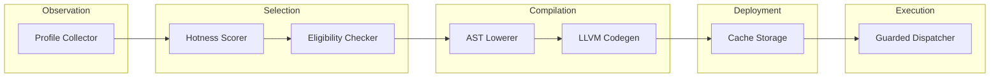
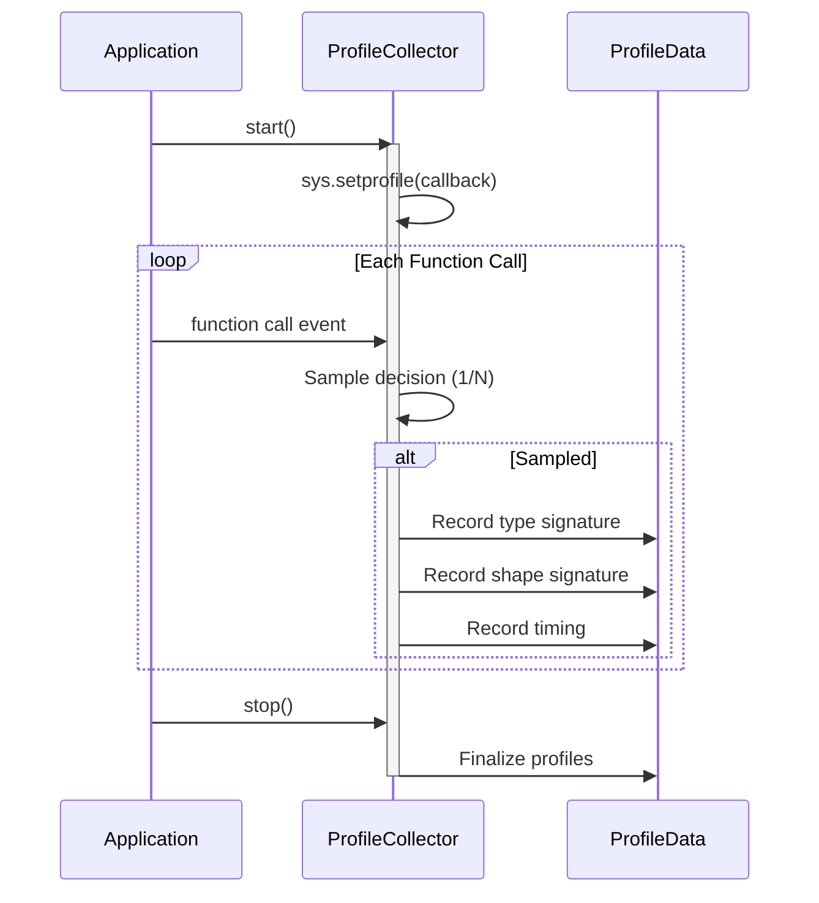
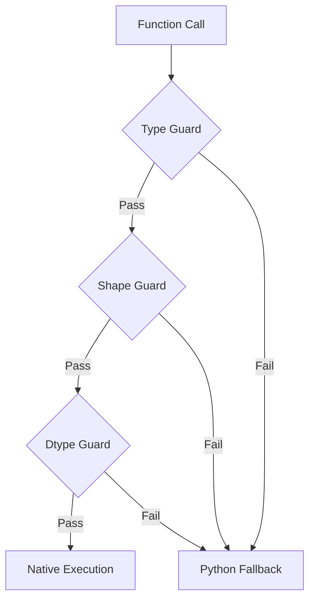
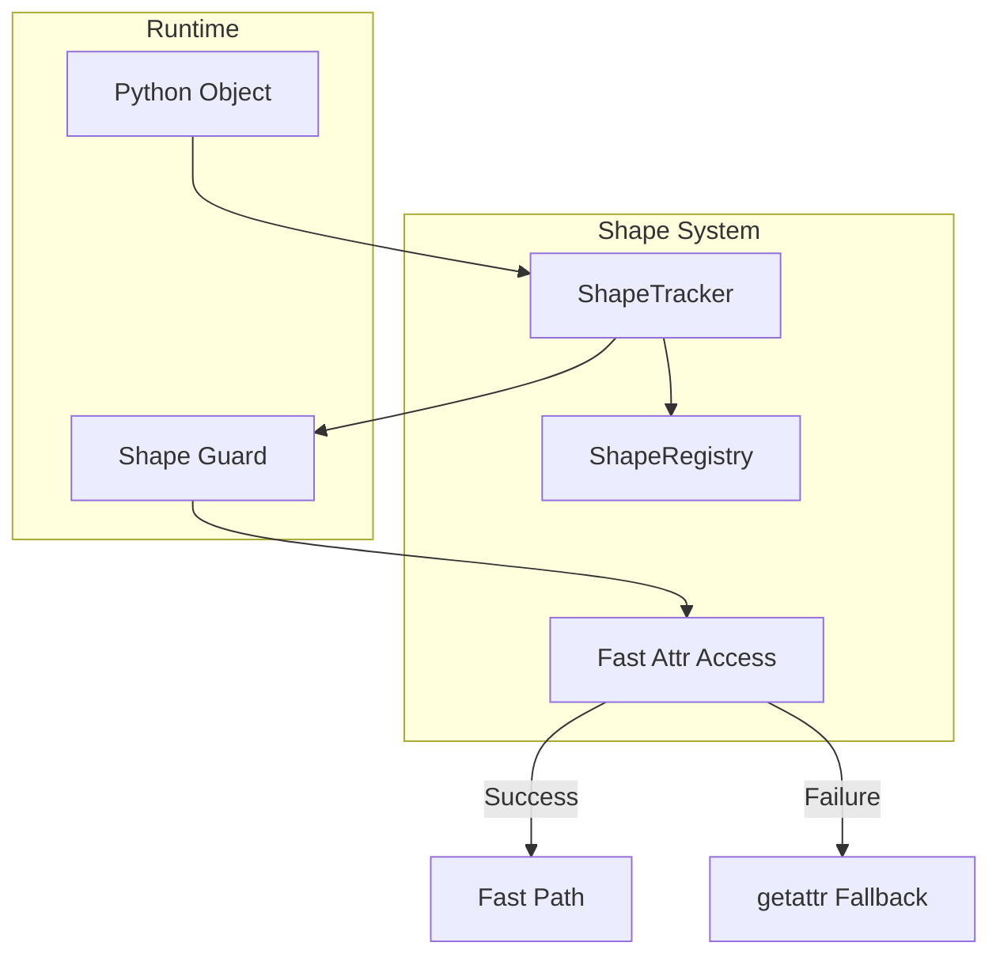
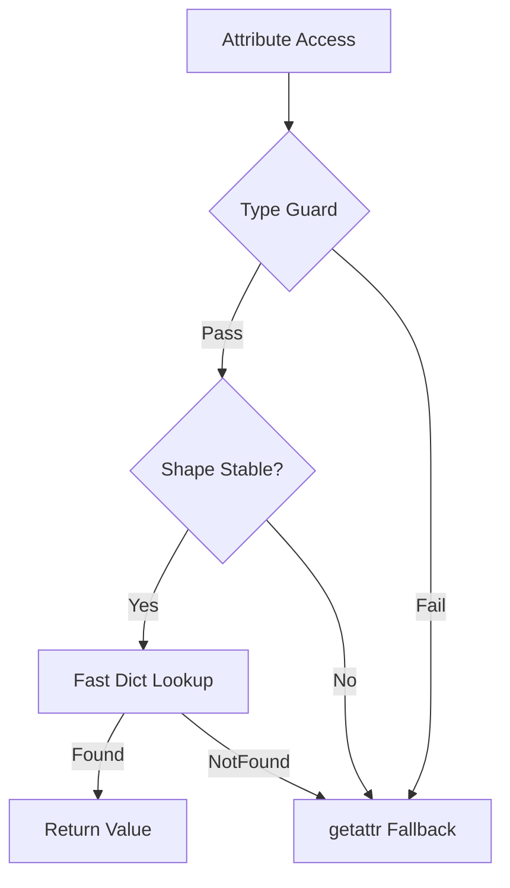
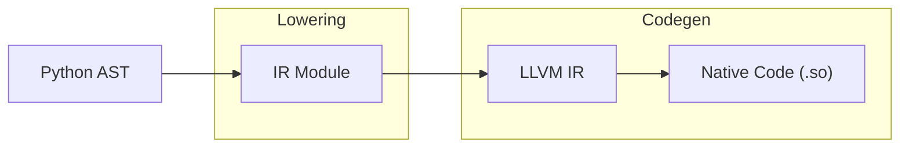
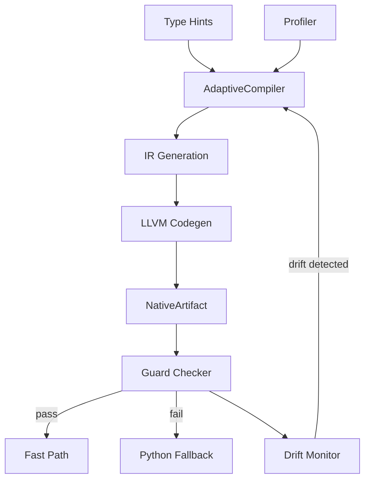
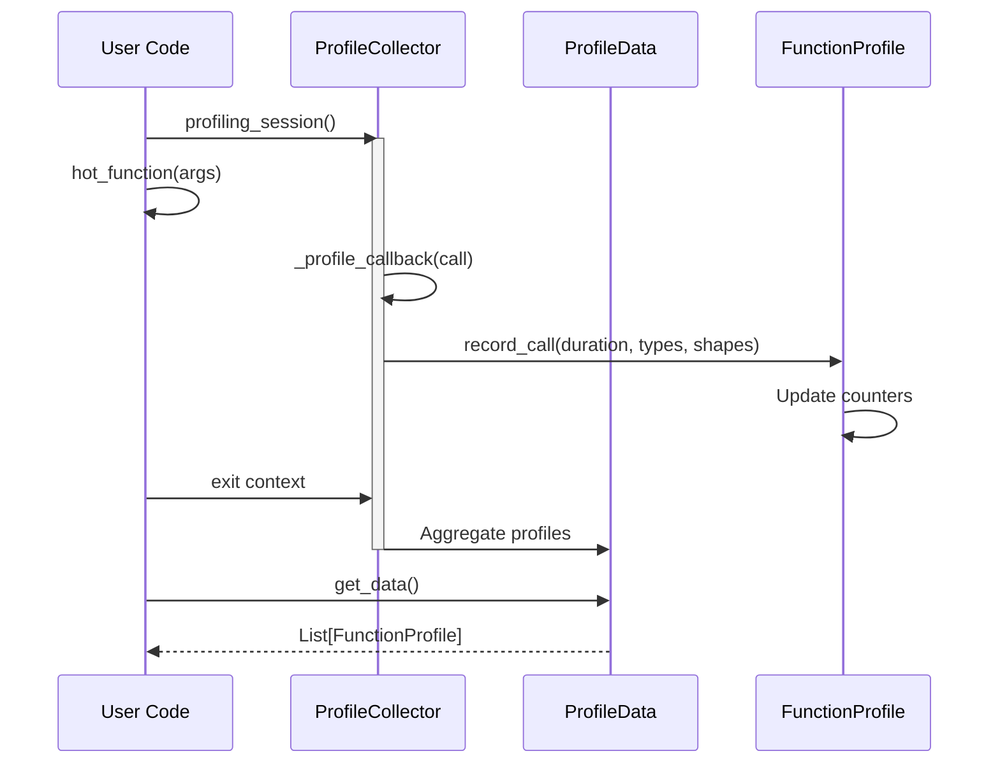
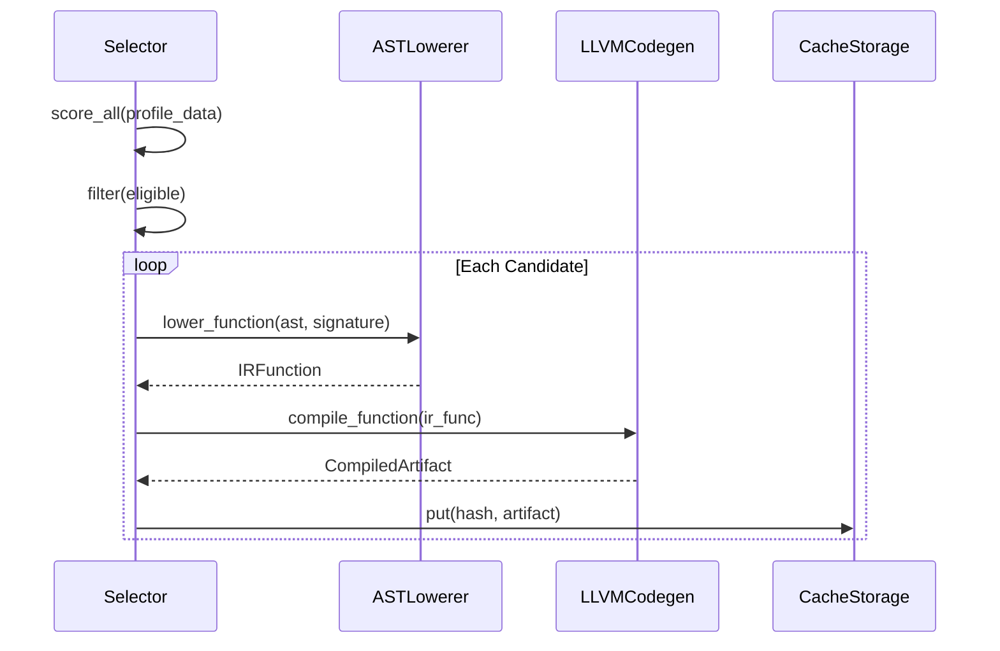
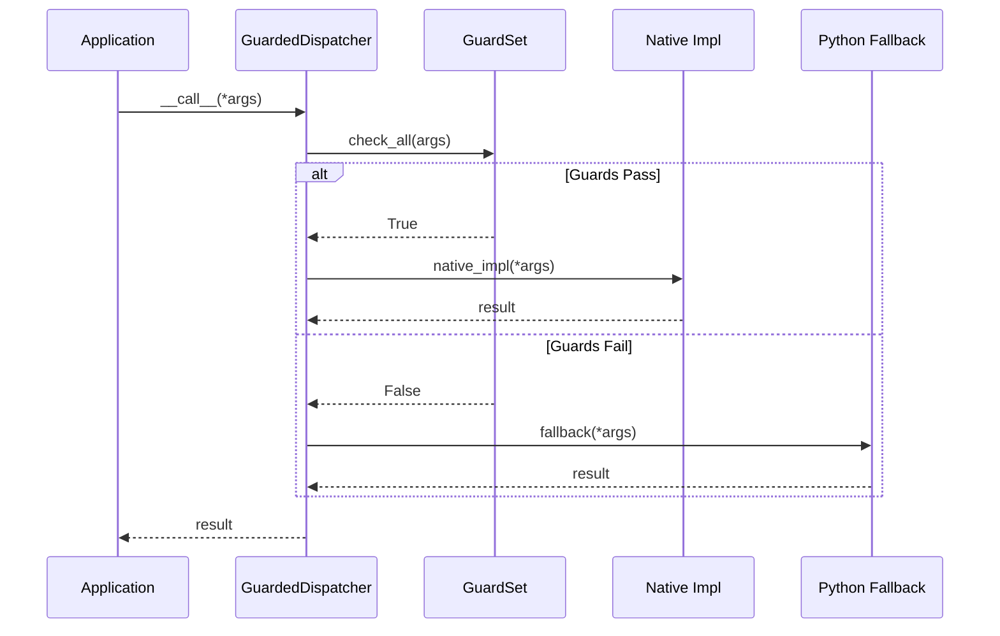

# PyAOT Architecture

## Abstract

PyAOT implements a profile-guided ahead-of-time (AOT) compilation system for Python that selectively compiles hot execution paths into native machine code. The system operates on the principle of *optimizing reality rather than the language*—profiling observes actual runtime behavior, compilation freezes observed type specializations, and guards preserve semantic correctness. This document describes the system architecture, component interactions, and design rationale.

---

## Table of Contents

1. [System Overview](#1-system-overview)
2. [Design Philosophy](#2-design-philosophy)
3. [Core Components](#3-core-components)
   - [Profiler Subsystem](#31-profiler-subsystem)
   - [Selector Subsystem](#32-selector-subsystem)
   - [Type System](#33-type-system)
   - [Shape System](#34-shape-system)
   - [Compiler Subsystem](#35-compiler-subsystem)
   - [Inline Subsystem](#36-inline-subsystem)
   - [Adaptive Subsystem](#37-adaptive-subsystem)
   - [Vectorization Subsystem](#38-vectorization-subsystem)
   - [Multi-Function Subsystem](#39-multi-function-subsystem)
   - [GPU Subsystem](#310-gpu-subsystem)
   - [Cache Subsystem](#311-cache-subsystem)
4. [Data Flow](#4-data-flow)
5. [Design Decisions](#5-design-decisions)
6. [Comparison with Related Systems](#6-comparison-with-related-systems)
7. [Limitations and Future Work](#7-limitations-and-future-work)
8. [References](#8-references)

---

## 1. System Overview

PyAOT operates through five sequential stages, each with distinct responsibilities:



| Stage | Component | Input | Output |
|-------|-----------|-------|--------|
| Observation | `ProfileCollector` | Python execution | `ProfileData` (call stats, types, shapes) |
| Selection | `HotnessScorer`, `EligibilityChecker` | `ProfileData` | Ranked candidate list |
| Compilation | `ASTLowerer`, `LLVMCodegen` | Python AST, type signatures | Native shared objects |
| Deployment | `CacheStorage` | Native artifacts | Content-addressed cache entries |
| Execution | `GuardedDispatcher` | Runtime arguments | Native or fallback execution |

---

## 2. Design Philosophy

### 2.1 Core Principle

> **"Optimize reality, not Python as a language. Profiling defines truth; compilation freezes it; guards preserve safety."**

This principle distinguishes PyAOT from speculative optimization approaches. Rather than assuming type behavior (as in traditional JIT compilation), PyAOT observes actual runtime behavior and only compiles functions that demonstrate stable, predictable patterns.

### 2.2 Profile-Guided vs. Speculative Optimization

| Approach | Mechanism | Failure Mode |
|----------|-----------|--------------|
| Speculative (e.g., V8) | Assume common types, deoptimize on mismatch | Deoptimization churn |
| Profile-Guided (PyAOT) | Observe first, compile only stable patterns | Conservative selection |

PyAOT's approach avoids the "type instability problem" that affects speculative JITs by requiring type stability *before* compilation, eliminating runtime deoptimization overhead.

### 2.3 Safety Guarantees

The system enforces strict correctness invariants:

1. **Semantic Preservation**: Compiled code produces identical results to Python interpretation
2. **Side Effect Correctness**: Observable side effects occur in the same order
3. **Fallback Safety**: Guard failures result in Python execution, never crashes
4. **State Consistency**: Guard failures never corrupt program state

---

## 3. Core Components

### 3.1 Profiler Subsystem

**Location**: `pyaot/profiler/`

The profiler collects runtime statistics using Python's `sys.setprofile` mechanism.



#### Key Classes

| Class | Responsibility |
|-------|----------------|
| `ProfileCollector` | Installs profiling hooks, manages sampling, routes events |
| `ProfileData` | Container for all function profiles |
| `FunctionProfile` | Per-function statistics: call count, timing, type/shape signatures |
| `TypeSignature` | Hashable representation of argument types |
| `ShapeSignature` | Hashable representation of array shapes |

#### Sampling Strategy

To maintain acceptable overhead (<5% target), the profiler uses statistical sampling:

```python
sample_rate = 1000  # Profile 1 in N calls in detail
```

Every call is counted, but detailed type/shape recording occurs only for sampled calls. This preserves call frequency accuracy while reducing per-call overhead.

### 3.2 Selector Subsystem

**Location**: `pyaot/selector/`

The selector ranks profiled functions by "hotness" and filters for compilability.

#### Hotness Formula

The hotness score quantifies a function's optimization potential:

```
type_stability = dominant_type_calls / total_calls
shape_stability = dominant_shape_calls / total_calls
stability_score = 0.5 × type_stability + 0.5 × shape_stability
hotness = cpu_time × call_count × stability_score
```

This formula prioritizes functions that are:
1. **Frequently called** (high `call_count`)
2. **Time-consuming** (high `cpu_time`)
3. **Type-stable** (high `stability_score`)

#### Eligibility Thresholds

| Parameter | Default | Rationale |
|-----------|---------|-----------|
| `min_call_count` | 100 | Statistical significance for type stability |
| `min_stability_score` | 0.95 | High confidence in type specialization |

#### AST Eligibility Analysis

The `EligibilityChecker` performs static analysis to detect disallowed patterns:

**Allowed Constructs**:
- Pure or mostly-pure functions
- Numeric types (`int`, `float`, `bool`)
- Typed containers with stable shapes
- NumPy arrays and buffers
- Deterministic loops
- Calls to whitelisted functions

**Disallowed Constructs**:
| Pattern | Rationale |
|---------|-----------|
| `eval`, `exec` | Dynamic code generation |
| Dynamic `getattr` | Unpredictable attribute access |
| Monkey patching | Global state mutation |
| Dynamic imports | Unpredictable dependencies |
| Exception-driven control flow | Complex CFG modeling |

### 3.3 Type System

**Location**: `pyaot/types/`

The type system bridges Python's dynamic types with the static types required for compilation.

#### Type Inference

The `InferredType` class represents types observed during profiling:

```python
@dataclass
class InferredType:
    kind: IRTypeKind  # INT32, INT64, FLOAT32, FLOAT64, ARRAY, etc.
    shape: Optional[Tuple[int, ...]]
    dtype: Optional[str]  # For arrays
```

#### Guard Generation

Guards are runtime checks that validate assumptions:



Guard types:
| Guard | Checks |
|-------|--------|
| `TYPE` | Python type identity (`type(arg) is expected`) |
| `SHAPE` | Array dimensions match expected shape |
| `DTYPE` | NumPy array dtype matches expected |
| `GLOBAL_VERSION` | Global variable version counter |

#### Guarded Dispatch

The `GuardedDispatcher` implements the fast-path/fallback pattern:

```python
def __call__(self, *args, **kwargs):
    if self.guards.check_all(args):
        return self.native_impl(*args, **kwargs)
    else:
        return self.fallback(*args, **kwargs)
```

Guard overhead is budgeted at <5% of call time.

### 3.4 Shape System

**Location**: `pyaot/shapes/`

The shape system provides side-table tracking of object attribute layouts, enabling fast attribute access optimization without modifying CPython object layout.

#### Shape Definition

A **shape** is an immutable identifier describing an object's attribute layout:

```python
@dataclass(frozen=True)
class Shape:
    type_id: int              # id(type(obj))
    dict_keys: Tuple[str, ...]  # tuple(obj.__dict__.keys())
```

Shapes capture the "structure" of an object's instance dictionary without accessing CPython internals.

#### Architecture



#### Key Components

| Component | Responsibility |
|-----------|----------------|
| `Shape` | Immutable descriptor: `(type_id, dict_keys)` |
| `ShapeRegistry` | Thread-safe global registry with ID assignment |
| `ShapeTracker` | Type-level stability detection (95% threshold) |
| `fast_getattr` | C extension for low-overhead attribute access |
| `guarded_attr_access` | Python wrapper with automatic fallback |

#### Shape Stability Detection

The `ShapeTracker` observes objects during profiling and determines which types have stable shapes:

```python
class ShapeTracker:
    def observe_object(self, obj) -> ShapeID:
        """Record shape observation for stability analysis."""
        
    def is_type_stable(self, type_id: int) -> bool:
        """Check if type has ≥95% consistent shape."""
        
    def get_common_shape(self, type_id: int) -> Optional[ShapeID]:
        """Get the dominant shape for stable types."""
```

A type is considered **shape-stable** when ≥95% of observed instances share the same shape (attribute layout).

#### C Extension API

The `_fast_attr.c` extension provides low-overhead attribute access:

```c
PyObject* fast_getattr(obj, expected_type, interned_attr_name)
```

Semantics:
- Returns attribute value on success
- Returns `GUARD_FAILED` sentinel on guard failure
- Uses `PyDict_GetItemWithError` (safe across CPython versions)
- Never raises exceptions internally

#### Guard Strategy

Attribute access optimization follows this exact pattern:

1. **Guard on type identity**: `type(obj) is expected_type`
2. **Guard on shape stability**: `tracker.is_type_stable(type_id)`
3. **Perform fast attribute access** via interned name lookup
4. **Fallback** to `getattr(obj, name)` on any guard failure



#### Safety Guarantees

| Guarantee | Implementation |
|-----------|----------------|
| Semantic preservation | Fast path returns identical values to `getattr()` |
| No crash on guard failure | Returns sentinel, caller falls back |
| Thread safety | Registry and Tracker use internal locks |
| CPython ABI safe | Uses only public C API functions |

### 3.5 Compiler Subsystem

**Location**: `pyaot/compiler/`

The compiler transforms Python AST into native code via an intermediate representation.



#### Intermediate Representation

The `IRModule` and `IRFunction` classes define a typed IR:

| IR Element | Purpose |
|------------|---------|
| `IRModule` | Container for functions |
| `IRFunction` | Typed function with basic blocks |
| `IRBasicBlock` | Sequence of instructions |
| `IRInstruction` | Single operation (opcodes: ADD, MUL, LOAD, STORE, etc.) |
| `IRType` | Static types: INT32, INT64, FLOAT32, FLOAT64, ARRAY |

#### AST Lowering

The `ASTLowerer` transforms Python AST nodes to IR:

| Python Construct | IR Translation |
|------------------|----------------|
| `for i in range(n)` | Counted loop with PHI nodes |
| `a + b` | ADD instruction |
| `arr[i]` | ARRAY_LOAD instruction |
| `if cond: ...` | Branch with basic blocks |

#### LLVM Code Generation

The `LLVMCodegen` class uses `llvmlite` to generate native code:

1. Convert IR types to LLVM types
2. Emit LLVM instructions for each IR instruction
3. Apply optimization passes
4. JIT compile to native function pointer
5. Create ctypes wrapper for Python interop

### 3.6 Inline Subsystem

**Location**: `pyaot/inline/`

The inline subsystem implements profile-guided call-boundary elimination. It detects hot monomorphic call sites and replaces Python function calls with guarded native code execution.

#### Eligibility Analysis

The `EligibilityAnalyzer` enforces strict criteria to ensure safety and performance:
1. **Hot**: ≥1000 observed calls
2. **Monomorphic**: ≥99.5% calls to same callee
3. **Leaf**: Callee makes no Python calls (except whitelisted math/builtins)
4. **Simple**: No `*args`, `**kwargs`, generators, or coroutines

#### Trampoline Mechanism

To safely inline while preserving Python semantics, PyAOT generates a **trampoline**:

```python
def trampoline(*args):
    # Fast Path: Check Guards
    if guards.check_all(args):
        return native_optimized_impl(*args)
    
    # Fallback: Original Python Call
    return python_original(*args)
```

This ensures that if assumptions are violated (e.g., passing a string to a numeric function), execution transparently falls back to the original Python implementation.

### 3.7 Adaptive Subsystem

**Location**: `pyaot/adaptive.py`, `pyaot/hints.py`

The adaptive subsystem provides unified compilation combining type hints, profiling, and continuous monitoring.

#### Type Hint Integration

When PEP 484 type annotations are present, functions can be compiled immediately without profiling warmup:

```python
from pyaot import adaptive

@adaptive
def multiply(a: float, b: float) -> float:
    return a * b

# Compiled immediately from type hints
result = multiply(3.0, 4.0)  # Executes via native LLVM code
```

The `TypeHintExtractor` extracts annotations and maps them to IR types:
- `float` → `IRTypeKind.FLOAT64`
- `int` → `IRTypeKind.INT64`
- `bool` → `IRTypeKind.BOOL`

#### Continuous PGO

Runtime monitoring tracks guard failures to detect type drift:

```python
if artifact.guard_failure_rate > drift_threshold:
    # Type drift detected, trigger recompilation
    recompile(artifact)
```

#### Source Hash Tracking

Source code changes invalidate cached artifacts:

```python
current_hash = compute_source_hash(func)
if current_hash != artifact.source_hash:
    invalidate_cache(func)
```

#### Architecture



### 3.8 Vectorization Subsystem

**Location**: `pyaot/compiler/vectorizer.py`

The vectorization subsystem transforms numeric loops to use SIMD instructions.

#### Loop Detection and Analysis

The `LoopVectorizer` analyzes loops for vectorization:

```python
from pyaot.compiler.vectorizer import LoopVectorizer

vectorizer = LoopVectorizer()
analyses = vectorizer.analyze_function(ir_func)

for analysis in analyses:
    if analysis.is_vectorizable:
        print(f"Loop can use {analysis.vector_width}-wide SIMD")
```

#### Supported SIMD Targets

| Platform | Target | Vector Width |
|----------|--------|--------------|
| x86_64 | SSE | 2×f64 (128-bit) |
| x86_64 | AVX2 | 4×f64 (256-bit) |
| x86_64 | AVX-512 | 8×f64 (512-bit) |
| ARM | NEON | 2×f64 (128-bit) |

### 3.9 Multi-Function Subsystem

**Location**: `pyaot/compiler/call_graph.py`, `pyaot/compiler/interprocedural.py`

Enables compilation of entire call chains as a single optimized unit.

#### Call Graph Analysis

```python
from pyaot.compiler.call_graph import CallGraphAnalyzer

analyzer = CallGraphAnalyzer()
graph = analyzer.build_graph(entry_function)
hot_chains = analyzer.find_hot_chains(graph, min_calls=1000)
```

#### Inter-Procedural Optimization

The `InterproceduralOptimizer` inlines call chains:

- Full inlining of chain functions
- Constant propagation across boundaries
- Dead code elimination

### 3.10 GPU Subsystem

**Location**: `pyaot/gpu/`

Provides CUDA backend for GPU acceleration.

#### Components

| File | Description |
|------|-------------|
| `cuda_codegen.py` | Generate CUDA kernels from IR |
| `runtime.py` | GPU memory and kernel management |
| `array.py` | NumPy-compatible GPU arrays |

#### GPUArray API

```python
from pyaot.gpu.array import GPUArray
import numpy as np

# Transfer to GPU
arr = GPUArray.from_numpy(np.array([1.0, 2.0, 3.0]))

# GPU operations
result = (arr * 2.0).sum()

# Transfer back
cpu_arr = arr.to_numpy()
```

### 3.11 Cache Subsystem

**Location**: `pyaot/cache/`

The cache provides persistent storage for compiled artifacts.

#### Content-Addressed Storage

Artifacts are stored using content hashes as keys:

```
~/.aot_cache/
├── a1/
│   ├── a1b2c3d4...so    # Native artifact
│   └── a1b2c3d4...json  # Metadata
├── b2/
│   └── ...
```

The two-character prefix provides directory sharding for filesystem efficiency.

#### Cache Key Generation

The `ArtifactHasher` generates deterministic keys from:
- Function source code
- Inferred type signatures
- Python version
- ABI tag

#### ABI Compatibility

The cache validates ABI compatibility before loading artifacts:

```python
def validate_abi(self, cache_key: str) -> bool:
    metadata = self.get_metadata(cache_key)
    return (
        metadata.python_version == current_python_version and
        metadata.abi_tag == current_abi_tag
    )
```

#### LRU Eviction

An LRU cache implementation (`lru.py`) manages memory-resident artifacts with configurable size limits.

---

## 4. Data Flow

### 4.1 Profiling Flow



### 4.2 Compilation Flow



### 4.3 Runtime Dispatch Flow



---

## 5. Design Decisions

### 5.1 Why Profile-Guided Optimization?

**Context**: Python's dynamic typing means type information is unavailable at compile time. Two approaches exist:

1. **Speculative JIT** (PyPy, V8): Assume types, deoptimize on mismatch
2. **Profile-Guided AOT** (PyAOT): Observe types, compile only stable patterns

**Decision**: Profile-guided AOT was chosen because:
- Eliminates deoptimization overhead
- Provides predictable performance (no JIT warmup)
- Simpler runtime—guards are cheap type checks
- Better suited for batch/server workloads where startup cost is amortized

**Tradeoff**: Conservative selection means some optimizable functions may be rejected if type stability is insufficient.

### 5.2 Why Guards Instead of Assumptions?

**Context**: Compiled code could assume types match profiled patterns without runtime checks.

**Decision**: Runtime guards were chosen for safety:
- Python allows arbitrary type changes at runtime
- Assumptions would violate semantic correctness
- Guard overhead (<5%) is acceptable for safety guarantee
- Fallback path maintains full Python semantics

**Implementation**: Guards use fast type identity checks (`type(arg) is expected`) rather than isinstance to minimize overhead.

### 5.3 Why LLVM as Backend?

**Context**: Multiple code generation options exist: direct machine code, C compilation, LLVM.

**Decision**: LLVM via `llvmlite` was chosen because:
- Mature optimization infrastructure (passes for dead code, inlining, vectorization)
- Cross-platform support (x86, ARM)
- Active ecosystem and tooling
- Used by related projects (Numba) providing proven patterns

**Tradeoff**: LLVM is a heavyweight dependency (~100MB). Future work could explore lighter alternatives for simple cases.

### 5.4 Positioning Relative to CPython 3.13+ JIT

**Context**: PEP 744 introduced a "copy-and-patch" JIT to CPython 3.13, targeting bytecode execution speedup.

**Complementary Approaches**:

| Aspect | CPython JIT | PyAOT |
|--------|-------------|-------|
| Target | All bytecode | Selected hot paths |
| Optimization | Inline caching, bytecode fusion | Type specialization, LLVM opts |
| Type handling | Speculative inline caches | Profile-guided guards |
| Compilation unit | Individual bytecodes | Entire functions |

The CPython JIT provides broad, modest improvements. PyAOT provides deep, targeted improvements for numeric workloads. The approaches are complementary—PyAOT can run on Python 3.13+ with the JIT enabled.

---

## 6. Comparison with Related Systems

| System | Model | Type Handling | Compilation | Python Compat |
|--------|-------|---------------|-------------|---------------|
| **PyAOT** | Profile-guided AOT | Guards + fallback | LLVM | Unmodified code |
| **Numba** | Decorator JIT | Explicit annotations | LLVM | `@jit` decorators |
| **Cython** | Static AOT | `.pyx` type syntax | C/C++ | Separate files |
| **PyPy** | Tracing JIT | Speculative + deopt | RPython | Alternative interpreter |
| **CPython 3.13 JIT** | Copy-and-patch | Inline caching | Pre-generated stencils | Built-in |
| **mypyc** | AOT from mypy types | Static type hints | C extension | Type-annotated code |

### Key Differentiators

**vs. Numba**: PyAOT operates without code modification. Numba requires explicit `@jit` decorators and has stricter type requirements. PyAOT's profile-guided approach discovers hot paths automatically.

**vs. Cython**: PyAOT processes standard Python files. Cython requires `.pyx` files with explicit type declarations. PyAOT provides a lower barrier to entry for optimization.

**vs. PyPy**: PyAOT integrates with CPython and the NumPy ecosystem. PyPy is an alternative interpreter with historical NumPy compatibility issues. PyAOT is a library, not a runtime replacement.

---

## 7. Limitations and Future Work

### Current Limitations

1. **Python Subset**: Only a subset of Python constructs can be compiled (no dynamic features)
2. **NumPy Dependency**: Array operations require NumPy for type/shape information
3. **Cold Start**: Initial profiling adds overhead before optimization benefits
4. **Single Types**: Each compiled variant handles one dominant type signature

### Future Work

1. **Multi-Dispatch**: Support multiple type variants per function
2. **Incremental Compilation**: Re-compile as profiles evolve
3. **GPU Targeting**: LLVM-based GPU code generation
4. **Distributed Profiling**: Aggregate profiles across cluster
5. **Integration with Type Hints**: Use PEP 484 annotations to guide compilation

---

## 8. References

1. **Profile-Guided Optimization**: [LLVM PGO Documentation](https://llvm.org/docs/HowToBuildWithPGO.html)
2. **CPython JIT (PEP 744)**: [PEP 744 – JIT Compilation](https://peps.python.org/pep-0744/)
3. **Numba**: [Numba Documentation](https://numba.pydata.org/)
4. **PyPy Tracing JIT**: [PyPy Documentation](https://doc.pypy.org/en/latest/jit/)
5. **llvmlite**: [llvmlite Documentation](https://llvmlite.readthedocs.io/)
6. **Type Stability**: Bezanson et al., "Julia: Dynamism and Performance Reconciled by Design," OOPSLA 2018
7. **Deoptimization in V8**: [V8 Blog - Speeding up JavaScript](https://v8.dev/blog)
