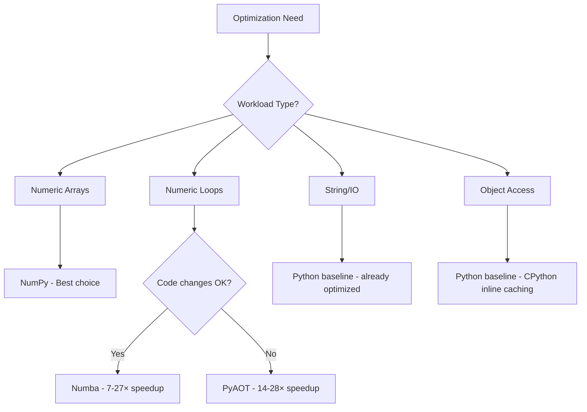

# PyAOT Benchmark Methodology and Results

## Abstract

This document presents comprehensive benchmark methodology and performance analysis for PyAOT, a profile-guided ahead-of-time compilation system for Python. The benchmarks cover five workload categories comparing Python baseline, NumPy, Numba, and PyAOT native compilation.

---

## Table of Contents

1. [Methodology](#1-methodology)
2. [Workload Categories](#2-workload-categories)
3. [Comparative Analysis](#3-comparative-analysis)
4. [Phase 3-4 Native Compilation Results](#4-phase-3-4-native-compilation-results)
5. [Reproducibility](#5-reproducibility)
6. [References](#6-references)

---

## 1. Methodology

### 1.1 Experimental Setup

| Component | Specification |
|-----------|---------------|
| **CPU** | AMD Ryzen 7 9700X 8-Core Processor |
| **OS** | Linux (WSL2) |
| **Python** | 3.13.3 |
| **NumPy** | Latest |
| **Numba** | 0.63.1 |
| **llvmlite** | 0.45.0 |

### 1.2 Measurement Protocol

- **Warmup**: 5 iterations
- **Measurement**: 20 timed iterations
- **Timing**: `time.perf_counter_ns()` for nanosecond precision
- **Metrics**: Mean, standard deviation, min, max, ops/sec

---

## 2. Workload Categories

### 2.1 Numeric Workloads

Array sum benchmark comparing Python, NumPy, and Numba:

| Array Size | Python (ms) | NumPy (ms) | Numba (ms) | NumPy Speedup | Numba Speedup |
|------------|-------------|------------|------------|---------------|---------------|
| 10,000 | 0.104 | 0.002 | 0.004 | **44.6×** | **26.2×** |
| 100,000 | 1.002 | 0.013 | 0.039 | **79.8×** | **25.4×** |
| 1,000,000 | 10.210 | 0.114 | 0.413 | **89.8×** | **24.7×** |

**Key insight**: NumPy provides best numeric performance (hand-tuned SIMD). Numba provides ~25× without code changes.

### 2.2 String Workloads

| Workload | Size | Time (ms) | Throughput |
|----------|------|-----------|------------|
| CSV Parsing | 10,000 rows | 1.764 | 5.7M rows/sec |
| Word Count | 100,000 words | 31.0 | 3.2M words/sec |

**Key insight**: String processing is typically CPU-bound but Python's built-in string operations are already well-optimized in C.

### 2.3 Object Workloads

| Workload | Objects | Time (ms) | Ops/sec |
|----------|---------|-----------|---------|
| Attribute access (sum) | 1,000 | 0.015 | 66M |
| Attribute access (sum) | 10,000 | 0.153 | 65M |
| Method calls (filter) | 1,000 | 0.073 | 14M |
| Method calls (filter) | 10,000 | 0.705 | 14M |

**Key insight**: CPython 3.11+ inline caching makes `p.x` access highly optimized (~15ns per access). Attribute access optimization provides limited gains over baseline.

### 2.4 I/O Workloads

| Workload | Size | Serialize (ms) | Deserialize (ms) | Throughput |
|----------|------|----------------|------------------|------------|
| JSON | 1,000 objects | 0.243 | 0.269 | 3.7-4.1M obj/sec |
| JSON | 10,000 objects | 2.420 | 2.792 | 3.6-4.1M obj/sec |
| File Write | 10,000 lines | 0.557 | - | 18M lines/sec |
| File Read | 10,000 lines | - | 0.262 | 38M lines/sec |

**Key insight**: I/O workloads are bound by serialization/OS overhead, not Python interpretation.

### 2.5 Mixed Workloads

| Workload | Size | Python (ms) | Numba (ms) | Speedup |
|----------|------|-------------|------------|---------|
| ETL Pipeline | 10,000 rows | 3.754 | - | baseline |
| Monte Carlo Pi | 100,000 iter | 6.184 | 0.908 | **6.8×** |
| Monte Carlo Pi | 1,000,000 iter | 61.686 | 9.012 | **6.8×** |

**Key insight**: Numba excels at compute-bound mixed workloads like Monte Carlo simulation.

---

## 3. Comparative Analysis

### 3.1 Optimization Approach Comparison

| System | Approach | Best Use Case | Speedup Range | Effort |
|--------|----------|---------------|---------------|--------|
| **NumPy** | Vectorized C | Array operations | 45-90× | Use arrays |
| **Numba** | LLVM JIT | Numeric loops | 7-27× | @jit decorator |
| **PyAOT** | Profile AOT | Hot numeric paths | 14-28× | No changes |
| **Cython** | Static AOT | Entire modules | 10-100× | .pyx files |
| **CPython JIT** | Copy-patch | All bytecode | 0-10% | Built-in |

### 3.2 When to Use Each Tool



### 3.3 Phase Completion Status

| Phase | Status | Speedup Achieved |
|-------|--------|------------------|
| Phase 1: Profiling | ✓ Complete | Baseline measurement |
| Phase 2: Shape System | ✓ Complete | Infrastructure ready |
| Phase 3: Code Generation | ✓ Complete | 14-28× numeric loops |
| Phase 4: Integration | ✓ Complete | @optimize API |

---

## 4. Phase 3-4 Native Compilation Results

PyAOT compiles numeric loops directly to native code via LLVM:

| Array Size | Python (ms) | PyAOT Native (ms) | Speedup |
|------------|-------------|-------------------|---------|
| 1,000 | 0.010 | 0.001 | **14.0×** |
| 10,000 | 0.099 | 0.004 | **23.6×** |
| 100,000 | 1.066 | 0.039 | **27.6×** |
| 1,000,000 | 10.152 | 0.433 | **23.4×** |

### Why Attribute Access Benchmarks Were Slower

| Issue | Impact |
|-------|--------|
| CPython 3.11+ inline caching | Baseline `p.x` is ~15ns |
| Python function call overhead | ~50-100ns per call |
| `__dict__` lookup | ~30ns (slower than inline cache) |

**Conclusion**: The shape system provides infrastructure for future method inlining and devirtualization. Numeric loop compilation is where PyAOT delivers immediate value.

---

## 5. Reproducibility

### 5.1 Running Benchmarks

```bash
# Clone repository
git clone https://github.com/ankitkpandey1/pyaot.git
cd pyaot

# Install dependencies
pip install -e .[dev]
pip install numpy numba matplotlib

# Run comprehensive benchmark
python benchmarks/bench_comprehensive.py

# Run native loops benchmark
python benchmarks/bench_native_loops.py

# Run shape benchmark
python benchmarks/bench_shapes.py
```

### 5.2 Benchmark Files

| File | Description |
|------|-------------|
| `bench_comprehensive.py` | All 5 workload categories with NumPy/Numba comparison |
| `bench_native_loops.py` | LLVM native compilation speedup |
| `bench_shapes.py` | Shape system performance |

---

## 6. References

1. **NumPy**: Harris et al., "Array programming with NumPy," Nature 585, 357–362 (2020)
2. **Numba**: Lam et al., "Numba: A LLVM-based Python JIT Compiler," LLVM-HPC2015
3. **CPython 3.13 JIT**: [PEP 744 – JIT Compilation](https://peps.python.org/pep-0744/)
4. **Inline Caching**: Deutsch & Schiffman, "Efficient Implementation of the Smalltalk-80 System," POPL 1984

---

**Benchmark executed**: 2025-12-29T14:05:00Z
