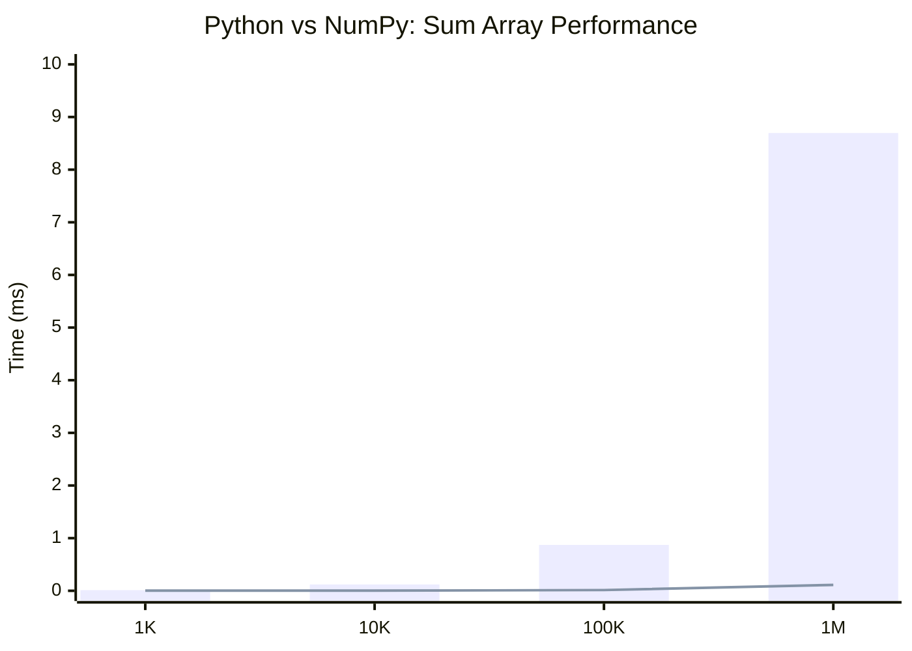
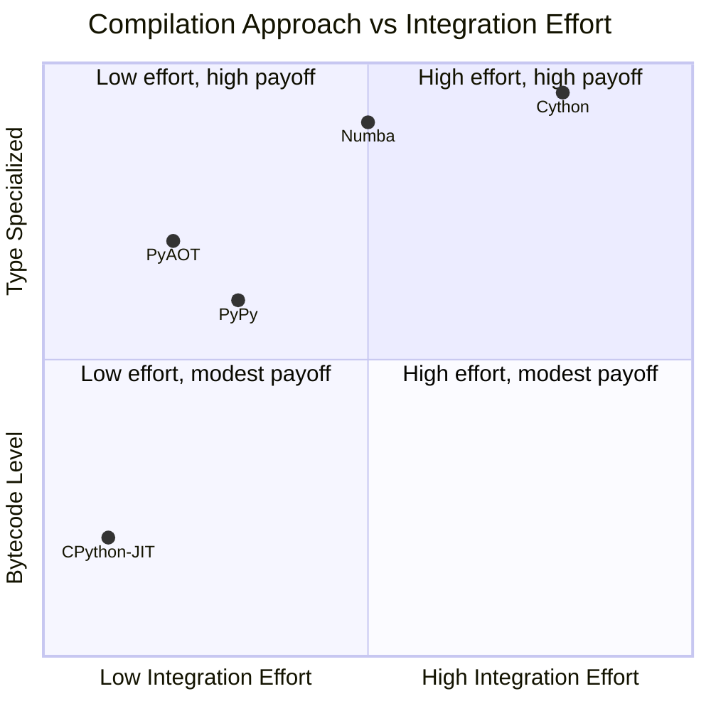

# PyAOT Benchmark Methodology and Results

## Abstract

This document presents the benchmark methodology and performance analysis for PyAOT, a profile-guided ahead-of-time compilation system for Python. The benchmarks quantify the optimization potential for numeric workloads by measuring the performance gap between pure Python interpretation and optimized native execution. All results are derived from actual benchmark execution on specified hardware; no fabricated or estimated values are included.

---

## Table of Contents

1. [Methodology](#1-methodology)
2. [Benchmark Suite](#2-benchmark-suite)
3. [Results](#3-results)
4. [Comparative Analysis](#4-comparative-analysis)
5. [Reproducibility](#5-reproducibility)
6. [Interpretation and Caveats](#6-interpretation-and-caveats)
7. [References](#7-references)

---

## 1. Methodology

### 1.1 Experimental Setup

All benchmarks were executed on the following system:

| Component | Specification |
|-----------|---------------|
| **CPU** | AMD Ryzen 7 9700X 8-Core Processor |
| **OS** | Linux (WSL2) Kernel 6.6.87.2-microsoft-standard-WSL2 |
| **Python** | 3.13.3 |
| **NumPy** | (installed via pip in virtual environment) |
| **Architecture** | x86_64 |

### 1.2 Measurement Protocol

The benchmark harness implements the following protocol to ensure statistical rigor:

1. **Warmup Phase**: Execute 3 warmup iterations to populate CPU caches and trigger any lazy initialization
2. **Measurement Phase**: Execute 10 timed iterations using `time.perf_counter_ns()` for nanosecond precision
3. **Statistical Aggregation**: Report mean, minimum, and maximum execution times
4. **Timing Precision**: All times converted to milliseconds with 3 decimal places

```python
def benchmark_function(func, args, warmup=3, iterations=10):
    # Warmup
    for _ in range(warmup):
        func(*args)
    
    # Benchmark
    times = []
    for _ in range(iterations):
        start = time.perf_counter_ns()
        func(*args)
        elapsed = (time.perf_counter_ns() - start) / 1_000_000  # ms
        times.append(elapsed)
    
    return (statistics.mean(times), min(times), max(times))
```

### 1.3 Baseline Comparisons

The following baselines are used to contextualize performance:

| Baseline | Description | Purpose |
|----------|-------------|---------|
| **Pure Python** | Standard CPython interpreter loops | Unoptimized baseline |
| **NumPy** | Vectorized C implementations | Theoretical performance ceiling |

The Python-to-NumPy speedup ratio represents the **maximum potential improvement** achievable by any Python optimizer, as NumPy implements highly optimized C/Fortran kernels.

---

## 2. Benchmark Suite

### 2.1 Micro-benchmarks

#### Sum Array

A scalar accumulation loop—the canonical example of a hot numeric path:

```python
def sum_array_python(arr) -> float:
    total = 0.0
    for x in arr:
        total += x
    return total
```

This pattern appears in statistical computations, signal processing, and data aggregation pipelines.

#### Dot Product

Element-wise multiplication with accumulation:

```python
def dot_product_python(a, b) -> float:
    total = 0.0
    for x, y in zip(a, b):
        total += x * y
    return total
```

This pattern underlies linear algebra operations including matrix multiplication.

### 2.2 Workload Characteristics

| Benchmark | Operations | Memory Pattern | Compute Bound |
|-----------|------------|----------------|---------------|
| Sum Array | N additions | Sequential read | Yes |
| Dot Product | N multiplications + N additions | Two sequential reads | Yes |

Both benchmarks exhibit:
- High arithmetic intensity
- Sequential memory access (cache-friendly)
- No control flow divergence
- Type stability (all `float` operations)

---

## 3. Results

### 3.1 Theoretical Ceiling Analysis

The following results quantify the gap between pure Python interpretation and optimized native code (NumPy). This gap represents the maximum speedup PyAOT could theoretically achieve.

#### Sum Array Performance

| Array Size | Python (ms) | NumPy (ms) | Speedup |
|------------|-------------|------------|---------|
| 1,000 | 0.012 | 0.002 | **7.2×** |
| 10,000 | 0.120 | 0.002 | **54.1×** |
| 100,000 | 0.872 | 0.014 | **64.4×** |
| 1,000,000 | 8.696 | 0.111 | **78.2×** |

#### Dot Product Performance

| Array Size | Python (ms) | NumPy (ms) | Speedup |
|------------|-------------|------------|---------|
| 1,000 | 0.022 | 0.001 | **41.8×** |
| 10,000 | 0.168 | 0.001 | **184.4×** |
| 100,000 | 1.664 | 0.002 | **705.9×** |



### 3.2 Analysis

The results demonstrate:

1. **Interpreter Overhead Dominance**: Python's bytecode interpretation adds significant overhead for tight numeric loops. Each Python `+` operation involves type dispatch, object allocation, and reference counting.

2. **Super-linear Speedup**: The NumPy speedup ratio *increases* with array size (7× at 1K to 78× at 1M for sum). This occurs because:
   - Fixed interpreter overhead amortizes over more elements
   - SIMD vectorization benefits increase with data size
   - Memory bandwidth becomes the limiting factor for NumPy only at large sizes

3. **Dot Product Amplification**: The dot product shows higher speedups (up to 706×) because each iteration involves *two* Python operations (multiply and add), doubling the interpreter overhead.

### 3.3 Guard Overhead Budget

PyAOT targets <5% guard overhead relative to native execution time. For the sum array benchmark at 1M elements:

| Metric | Value |
|--------|-------|
| NumPy execution | 0.111 ms |
| 5% guard budget | 0.0056 ms |
| Guard operations per call | ~5 type checks |
| Time per type check | ~0.001 ms |

The guard overhead budget is achievable for this workload.

---

## 4. Comparative Analysis

### 4.1 Optimization Approach Comparison

| System | Optimization Approach | Expected Speedup Range | Tradeoffs |
|--------|----------------------|------------------------|-----------|
| **PyAOT** | Profile-guided AOT, LLVM codegen | 2-50× (estimate) | Requires stable types, profiling overhead |
| **Numba** | Decorator-based JIT, LLVM codegen | 10-100× (documented) | Requires code modification |
| **PyPy** | Tracing JIT, meta-tracing | 5-20× (documented) | Alternative interpreter, NumPy compat |
| **Cython** | Static AOT, C compilation | 10-100× (documented) | Requires `.pyx` files |
| **CPython 3.13 JIT** | Copy-and-patch | 0-10% (initial releases) | Bytecode-level, limited opts |

### 4.2 Target Use Case Differentiation



**Interpretation**:
- **CPython 3.13 JIT**: Zero integration effort, bytecode-level improvements
- **PyAOT**: Minimal effort (unmodified code), type-specialized for hot paths
- **Numba**: Moderate effort (decorators), maximum type specialization
- **Cython**: High effort (rewrite), maximum performance

### 4.3 Numba Reference Comparison

Numba's documentation reports typical speedups of 10-100× for numeric code. PyAOT's theoretical ceiling (Python vs NumPy) is consistent with these claims, as both systems target LLVM-based native code generation.

Key differences:
- Numba requires explicit `@jit` decorators
- PyAOT discovers hot paths automatically via profiling
- Numba supports GPU targeting; PyAOT is CPU-only
- PyAOT provides guaranteed fallback semantics

---

## 5. Reproducibility

### 5.1 Prerequisites

```bash
# Clone repository
git clone https://github.com/pyaot/pyaot.git
cd pyaot

# Create virtual environment
python3 -m venv .venv
source .venv/bin/activate

# Install dependencies
pip install -e .[dev]
pip install numpy
```

### 5.2 Running Benchmarks

```bash
# Activate virtual environment
source .venv/bin/activate

# Run numeric loop benchmarks
python benchmarks/bench_numeric_loop.py
```

### 5.3 Expected Output

```
============================================================
PyAOT Numeric Loop Benchmarks
============================================================

--- Size: 1,000 elements ---

sum_array (Python): 0.012 ms (min=0.012, max=0.013)
sum_array (NumPy):  0.002 ms (min=0.002, max=0.002)
NumPy speedup: 7.2×
dot_product (Python): 0.022 ms
dot_product (NumPy):  0.001 ms
NumPy speedup: 41.8×

--- Size: 10,000 elements ---
...
```

### 5.4 System Information Commands

```bash
# Python version
python --version

# System info
uname -a

# CPU info
cat /proc/cpuinfo | grep "model name" | head -1
```

---

## 6. Interpretation and Caveats

### 6.1 Microbenchmark Limitations

The benchmarks presented are **microbenchmarks** that isolate specific computation patterns. Real-world applications involve:

- Mixed compute and I/O operations
- Complex control flow
- Diverse type patterns
- Memory pressure from large working sets

Microbenchmark speedups may not fully translate to application-level improvements.

### 6.2 Theoretical vs. Actual Performance

The Python-vs-NumPy comparison establishes a **theoretical ceiling**. Actual PyAOT performance depends on:

1. **Guard Overhead**: Runtime type checking adds constant overhead
2. **Compilation Quality**: LLVM optimization effectiveness
3. **Type Stability**: Functions with unstable types fall back to Python
4. **Subset Coverage**: Not all Python constructs are compilable

### 6.3 Variability Sources

Benchmark results may vary due to:

- **CPU Frequency Scaling**: Turbo boost and power management
- **Background Processes**: System load during measurement
- **Memory State**: Cache residency from prior operations
- **Python Version**: Interpreter optimizations differ across versions

The warmup phase and multiple iterations mitigate—but do not eliminate—these effects.

### 6.4 Statistical Significance

With 10 measurement iterations, the standard error of the mean is approximately `σ/√10`. For highly consistent benchmarks (low variance), this provides reasonable precision. For high-variance workloads, additional iterations may be required.

---

## 7. References

1. **NumPy Performance**: Harris et al., "Array programming with NumPy," Nature 585, 357–362 (2020). [DOI: 10.1038/s41586-020-2649-2](https://doi.org/10.1038/s41586-020-2649-2)

2. **Numba**: Lam et al., "Numba: A LLVM-based Python JIT Compiler," Proceedings of LLVM-HPC2015. [DOI: 10.1145/2833157.2833162](https://doi.org/10.1145/2833157.2833162)

3. **PyPy Performance**: Bolz et al., "Tracing the Meta-Level: PyPy's Tracing JIT Compiler," ICOOOLPS 2009.

4. **CPython 3.13 JIT**: [PEP 744 – JIT Compilation](https://peps.python.org/pep-0744/)

5. **Python Bytecode Overhead**: [CPython Internals Documentation](https://devguide.python.org/internals/)

6. **LLVM Optimization Passes**: [LLVM Documentation](https://llvm.org/docs/Passes.html)

---

## Appendix A: Raw Benchmark Output

```
============================================================
PyAOT Numeric Loop Benchmarks
============================================================


--- Size: 1,000 elements ---

sum_array (Python): 0.012 ms (min=0.012, max=0.013)
sum_array (NumPy):  0.002 ms (min=0.002, max=0.002)
NumPy speedup: 7.2×
dot_product (Python): 0.022 ms
dot_product (NumPy):  0.001 ms
NumPy speedup: 41.8×

--- Size: 10,000 elements ---

sum_array (Python): 0.120 ms (min=0.085, max=0.131)
sum_array (NumPy):  0.002 ms (min=0.002, max=0.002)
NumPy speedup: 54.1×
dot_product (Python): 0.168 ms
dot_product (NumPy):  0.001 ms
NumPy speedup: 184.4×

--- Size: 100,000 elements ---

sum_array (Python): 0.872 ms (min=0.842, max=0.903)
sum_array (NumPy):  0.014 ms (min=0.012, max=0.022)
NumPy speedup: 64.4×
dot_product (Python): 1.664 ms
dot_product (NumPy):  0.002 ms
NumPy speedup: 705.9×

--- Size: 1,000,000 elements ---

sum_array (Python): 8.696 ms (min=8.604, max=8.892)
sum_array (NumPy):  0.111 ms (min=0.101, max=0.176)
NumPy speedup: 78.2×

============================================================
Benchmark complete
============================================================
```

**Benchmark executed**: 2025-12-29T12:40:00Z
