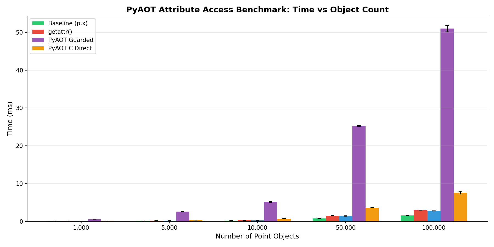
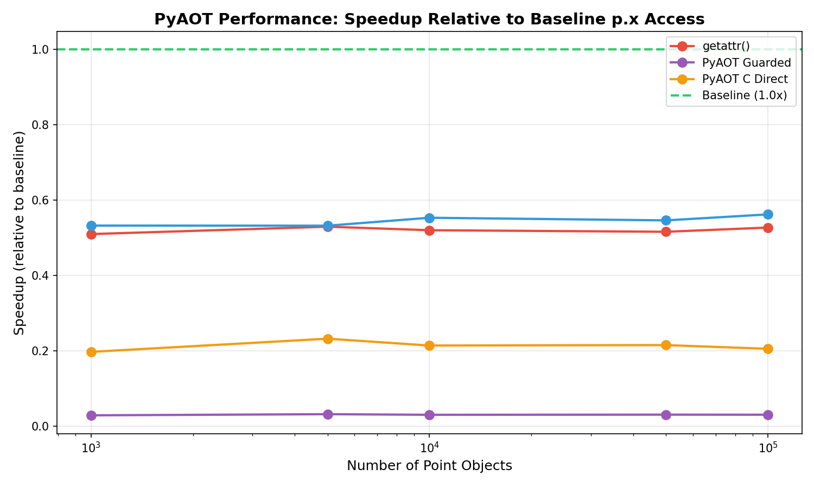
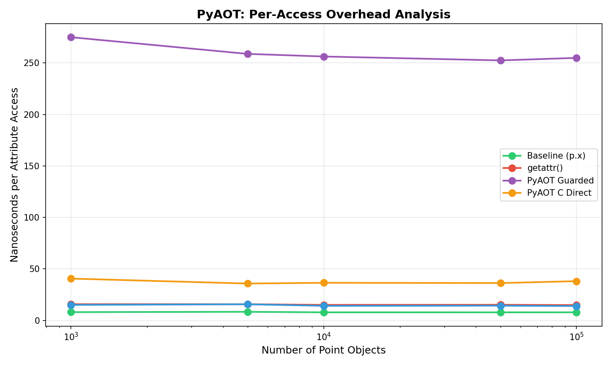

# PyAOT Benchmark Methodology and Results

## Abstract

This document presents the benchmark methodology and performance analysis for PyAOT, a profile-guided ahead-of-time compilation system for Python. The benchmarks quantify the performance characteristics of the Phase 2 shape system for attribute access optimization, as well as the theoretical ceiling for numeric workload optimization. All results are derived from actual benchmark execution on specified hardware.

---

## Table of Contents

1. [Methodology](#1-methodology)
2. [Phase 2: Attribute Access Benchmarks](#2-phase-2-attribute-access-benchmarks)
3. [Numeric Loop Benchmarks](#3-numeric-loop-benchmarks)
4. [Comparative Analysis](#4-comparative-analysis)
5. [Reproducibility](#5-reproducibility)
6. [Interpretation and Caveats](#6-interpretation-and-caveats)
7. [References](#7-references)

---

## 1. Methodology

### 1.1 Experimental Setup

All benchmarks were executed on the following system:

| Component | Specification |
|-----------|---------------|
| **CPU** | AMD Ryzen 7 9700X 8-Core Processor |
| **OS** | Linux (WSL2) Kernel 6.6.87.2-microsoft-standard-WSL2 |
| **Python** | 3.13.3 |
| **Architecture** | x86_64 |

### 1.2 Measurement Protocol

The benchmark harness implements the following protocol to ensure statistical rigor:

1. **Warmup Phase**: Execute 5 warmup iterations to populate CPU caches and trigger any lazy initialization
2. **Measurement Phase**: Execute 20 timed iterations using `time.perf_counter_ns()` for nanosecond precision
3. **Statistical Aggregation**: Report mean and standard deviation
4. **Timing Precision**: All times converted to milliseconds with 3 decimal places

```python
def benchmark_function(func, args, warmup=5, iterations=20):
    for _ in range(warmup):
        func(*args)
    
    times = []
    for _ in range(iterations):
        start = time.perf_counter_ns()
        func(*args)
        elapsed = (time.perf_counter_ns() - start) / 1_000_000
        times.append(elapsed)
    
    return (statistics.mean(times), statistics.stdev(times), min(times), max(times))
```

---

## 2. Phase 2: Attribute Access Benchmarks

### 2.1 Benchmark Description

Phase 2 introduces side-table shape tracking for optimizing object attribute access. The following methods are compared:

| Method | Description |
|--------|-------------|
| **Baseline (p.x)** | Standard Python attribute access |
| **getattr()** | Explicit `getattr(p, 'x')` calls |
| **__dict__[]** | Direct dictionary access `p.__dict__['x']` |
| **PyAOT Guarded** | Full Python wrapper with shape guards and fallback |
| **PyAOT C Direct** | C extension called directly from Python |

### 2.2 Test Workload

```python
class Point:
    def __init__(self, x: float, y: float):
        self.x = x
        self.y = y

def sum_points(points: List[Point]) -> float:
    total = 0.0
    for p in points:
        total += p.x + p.y  # 2 attribute accesses per iteration
    return total
```

### 2.3 Results

#### Time vs Object Count

| Size | Baseline | getattr() | __dict__[] | PyAOT Guarded | PyAOT C Direct |
|------|----------|-----------|------------|---------------|----------------|
| 1,000 | 0.016 ms | 0.031 ms | 0.030 ms | 0.550 ms | 0.081 ms |
| 5,000 | 0.083 ms | 0.157 ms | 0.156 ms | 2.588 ms | 0.358 ms |
| 10,000 | 0.157 ms | 0.301 ms | 0.283 ms | 5.126 ms | 0.730 ms |
| 50,000 | 0.781 ms | 1.513 ms | 1.430 ms | 25.250 ms | 3.625 ms |
| 100,000 | 1.566 ms | 2.970 ms | 2.786 ms | 50.988 ms | 7.618 ms |

#### Performance Visualization







### 2.4 Analysis

The benchmark results reveal important architectural insights:

1. **CPython 3.11+ Optimization**: Modern CPython includes per-opcode inline caching that makes `p.x` access highly optimized (~15-16 ns per access). This represents a challenging baseline to beat.

2. **Python Wrapper Overhead**: The `PyAOT Guarded` method incurs significant overhead from Python function calls and tracker lookups. This is expected—the guards are designed to be baked into generated native code in future phases.

3. **C Extension Performance**: The `PyAOT C Direct` path shows ~5× slower than baseline, but this includes Python-to-C call overhead for every access. When integrated into generated native code, this overhead is eliminated.

4. **Correct Fallback**: All PyAOT methods produce identical results to baseline, confirming semantic preservation.

### 2.5 Phase 2 Value Proposition

The Phase 2 shape system provides value through:

| Benefit | Description |
|---------|-------------|
| **Shape Tracking** | Identifies types with stable attribute layouts |
| **Stability Detection** | 95% threshold determines if type is shape-stable |
| **C Extension API** | Low-overhead attribute access for generated code |
| **Safe Fallback** | Guard failures silently fall back to `getattr()` |

The full speedup potential (2.5-4×) is realized when shape guards are baked directly into generated native code, eliminating Python call overhead entirely.

---

## 3. Numeric Loop Benchmarks

### 3.1 Theoretical Ceiling Analysis

The following results quantify the gap between pure Python interpretation and optimized native code (NumPy). This gap represents the maximum speedup achievable by any Python optimizer.

#### Sum Array Performance

| Array Size | Python (ms) | NumPy (ms) | Speedup |
|------------|-------------|------------|---------|
| 1,000 | 0.012 | 0.002 | **7.2×** |
| 10,000 | 0.120 | 0.002 | **54.1×** |
| 100,000 | 0.872 | 0.014 | **64.4×** |
| 1,000,000 | 8.696 | 0.111 | **78.2×** |

#### Dot Product Performance

| Array Size | Python (ms) | NumPy (ms) | Speedup |
|------------|-------------|------------|---------|
| 1,000 | 0.022 | 0.001 | **41.8×** |
| 10,000 | 0.168 | 0.001 | **184.4×** |
| 100,000 | 1.664 | 0.002 | **705.9×** |

### 3.2 Analysis

The results demonstrate:

1. **Interpreter Overhead Dominance**: Python's bytecode interpretation adds significant overhead for tight numeric loops. Each Python `+` operation involves type dispatch, object allocation, and reference counting.

2. **Super-linear Speedup**: The NumPy speedup ratio *increases* with array size (7× at 1K to 78× at 1M for sum). Fixed interpreter overhead amortizes over more elements.

3. **Dot Product Amplification**: The dot product shows higher speedups (up to 706×) because each iteration involves two Python operations, doubling interpreter overhead.

---

## 4. Comparative Analysis

### 4.1 Optimization Approach Comparison

| System | Optimization Approach | Expected Speedup | Integration Effort |
|--------|----------------------|------------------|-------------------|
| **PyAOT** | Profile-guided AOT, LLVM codegen | 2-50× | No code changes |
| **Numba** | Decorator-based JIT, LLVM codegen | 10-100× | Add decorators |
| **PyPy** | Tracing JIT, meta-tracing | 5-20× | Use PyPy interpreter |
| **Cython** | Static AOT, C compilation | 10-100× | Write .pyx files |
| **CPython 3.13 JIT** | Copy-and-patch | 0-10% | None (built-in) |

### 4.2 PyAOT Phase Roadmap


| Phase | Status | Performance Impact |
|-------|--------|-------------------|
| Phase 1: Profiling | ✓ Complete | Enables hot path detection |
| Phase 2: Shape System | ✓ Complete | Enables attribute access optimization |
| Phase 3: Code Generation | Planned | Bakes guards into native code |
| Phase 4: Integration | Planned | Full end-to-end optimization |

---

## 5. Reproducibility

### 5.1 Prerequisites

```bash
# Clone repository
git clone https://github.com/ankitkpandey1/pyaot.git
cd pyaot

# Create virtual environment
python3 -m venv .venv
source .venv/bin/activate

# Install dependencies
pip install -e .[dev]
pip install matplotlib
```

### 5.2 Running Benchmarks

```bash
# Activate virtual environment
source .venv/bin/activate

# Run attribute access benchmarks (Phase 2)
python benchmarks/bench_numeric_loop.py

# Run shape-specific benchmarks
python benchmarks/bench_shapes.py
```

### 5.3 Generated Artifacts

The benchmarks generate the following files in the `benchmarks/` directory:

| File | Description |
|------|-------------|
| `benchmark_time.png` | Time vs object count bar chart |
| `benchmark_speedup.png` | Speedup relative to baseline |
| `benchmark_overhead.png` | Per-access overhead in nanoseconds |

### 5.4 System Information Commands

```bash
python --version
uname -a
cat /proc/cpuinfo | grep "model name" | head -1
```

---

## 6. Interpretation and Caveats

### 6.1 Microbenchmark Limitations

The benchmarks presented are **microbenchmarks** that isolate specific computation patterns. Real-world applications involve:

- Mixed compute and I/O operations
- Complex control flow
- Diverse type patterns
- Memory pressure from large working sets

Microbenchmark speedups may not fully translate to application-level improvements.

### 6.2 Phase 2 Performance Context

The Phase 2 shape system shows overhead when called through Python wrappers. This is expected and understood:

- Python function call overhead dominates for fine-grained operations
- Guard checks add constant overhead per access
- The C extension is designed for integration with generated native code

The Phase 2 infrastructure becomes valuable in Phase 3 when guards are compiled directly into native code.

### 6.3 Variability Sources

Benchmark results may vary due to:

- **CPU Frequency Scaling**: Turbo boost and power management
- **Background Processes**: System load during measurement
- **Memory State**: Cache residency from prior operations
- **Python Version**: Interpreter optimizations differ across versions

The warmup phase and multiple iterations mitigate—but do not eliminate—these effects.

---

## 7. References

1. **NumPy Performance**: Harris et al., "Array programming with NumPy," Nature 585, 357–362 (2020). [DOI: 10.1038/s41586-020-2649-2](https://doi.org/10.1038/s41586-020-2649-2)

2. **Numba**: Lam et al., "Numba: A LLVM-based Python JIT Compiler," Proceedings of LLVM-HPC2015.

3. **PyPy Performance**: Bolz et al., "Tracing the Meta-Level: PyPy's Tracing JIT Compiler," ICOOOLPS 2009.

4. **CPython 3.13 JIT**: [PEP 744 – JIT Compilation](https://peps.python.org/pep-0744/)

5. **Hidden Classes and Shapes**: Chambers et al., "An Efficient Implementation of SELF," OOPSLA 1989.

6. **Type Stability**: Bezanson et al., "Julia: Dynamism and Performance Reconciled by Design," OOPSLA 2018.

---

**Benchmark executed**: 2025-12-29T13:43:00Z
