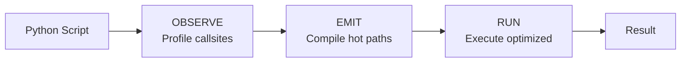
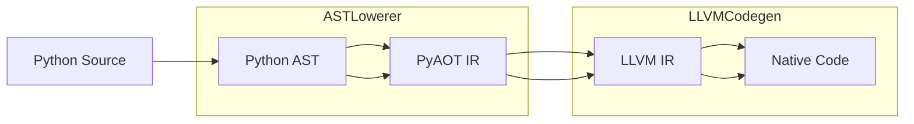
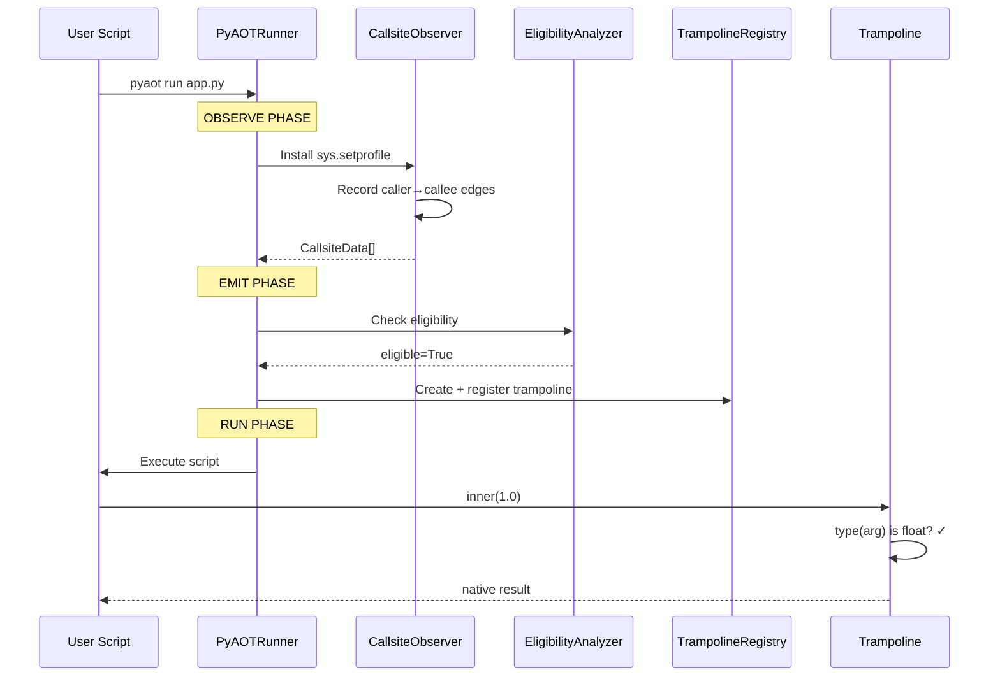
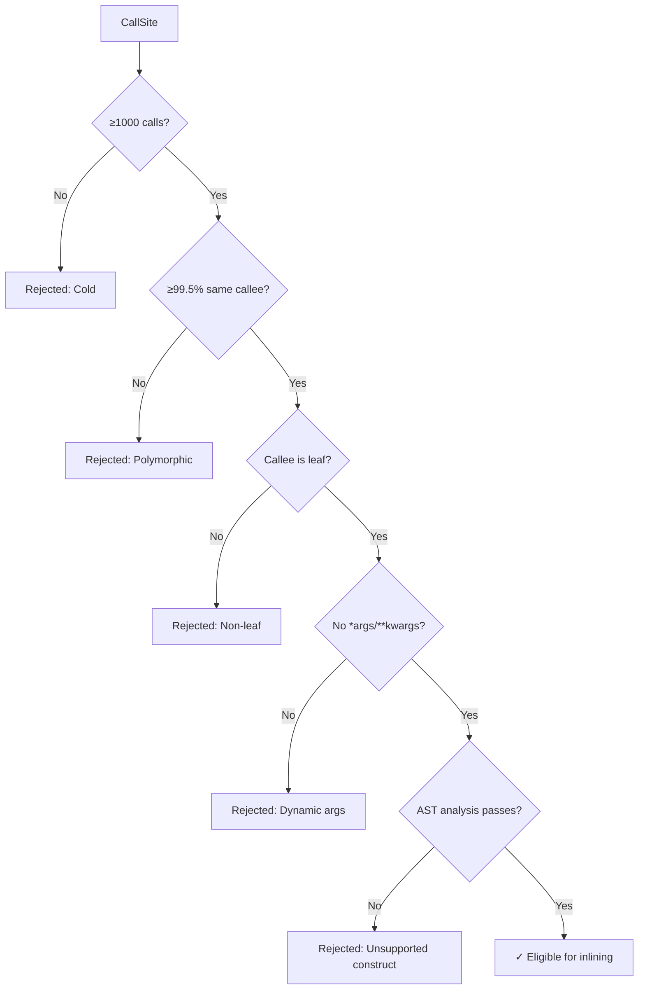

# PyAOT: How It Works

This document provides a practical walkthrough of PyAOT's internal operation, tracing the code flow from a user's Python script to optimized native execution.

---

## The Big Picture

PyAOT executes a three-phase pipeline: **Observe → Emit → Run**.



---

## Example Walkthrough

Consider this script (`app.py`):

```python
def inner(x):
    return x * 2 + 1

def outer(n):
    total = 0.0
    for i in range(n):
        total += inner(float(i))
    return total

result = outer(1_000_000)
print(f"Result: {result}")
```

When you run:

```bash
pyaot run app.py
```

PyAOT automatically optimizes the hot call from `outer` → `inner`.

---

## Phase 1: OBSERVE

**Goal**: Profile the script to discover hot callsites and their type signatures.

### Code Flow

```
pyaot/runner.py:PyAOTRunner.run()
    └── _observe_phase()
        └── _execute_script(capture_callees=True)
            └── pyaot/inline/callsite.py:CallsiteObserver
                └── sys.setprofile() callback
```

### What Happens

1. **Install profiler hook**: `sys.setprofile()` intercepts every function call/return
2. **Record callsites**: For each `call` event, record:
   - Caller function (e.g., `outer`)
   - Callee function (e.g., `inner`)
   - Argument types (e.g., `float`)
3. **Count frequencies**: Track how many times each caller→callee edge fires
4. **Store callee references**: Capture the actual function objects for later compilation

### Key Data Structures

```python
# pyaot/inline/callsite.py
@dataclass
class CallsiteData:
    caller_key: str           # "module:outer"
    callee_key: str           # "module:inner"
    call_count: int           # 1,000,000
    type_signatures: Dict     # {(float,): 1000000}
    callee_func: Callable     # <function inner>
```

### Output

After observation:
- `outer → inner` called 1,000,000 times
- Type signature: `(float,)` with 100% stability

---

## Phase 2: EMIT

**Goal**: Identify eligible callsites and compile optimized trampolines.

### Code Flow

```
pyaot/runner.py:PyAOTRunner.run()
    └── _emit_phase()
        ├── Filter: hot + monomorphic + leaf
        ├── pyaot/inline/eligibility.py:EligibilityAnalyzer().analyze()
        ├── pyaot/inline/guards.py:create_inline_guards()
        └── pyaot/inline/expansion.py:create_guarded_inline()
            └── create_trampoline() + register
```

### What Happens

1. **Filter candidates**: Check each callsite against eligibility criteria:
   - **Hot**: ≥1000 calls (configurable)
   - **Monomorphic**: ≥99.5% calls to same callee
   - **Leaf**: Callee makes no Python calls (except math/builtins)
   - **Simple**: No `*args`, `**kwargs`, generators

2. **Analyze callee AST**: Ensure the callee is compilable:
   ```python
   # pyaot/inline/eligibility.py
   analyzer = EligibilityAnalyzer()
   result = analyzer.analyze(callee_func)
   # result.eligible = True, result.reason = "Eligible for inlining"
   ```

3. **Create guards**: Generate runtime type checks:
   ```python
   # pyaot/inline/guards.py
   guards = create_inline_guards(callee_func, dominant_signature)
   # Guards check: type(arg0) is float
   ```

4. **Create trampoline**: Build the fast-path/fallback dispatcher:
   ```python
   # pyaot/inline/trampoline.py
   def trampoline(*args):
       if guards.check_all(args):
           return native_optimized(*args)  # Fast path
       return original_callee(*args)       # Fallback
   ```

5. **Register trampoline**: Store in global registry for runtime dispatch:
   ```python
   registry = get_trampoline_registry()
   registry.register(callee_func, trampoline)
   ```

### Key Data Structures

```python
# pyaot/inline/trampoline.py
class TrampolineRegistry:
    _trampolines: Dict[int, Callable]  # id(func) → trampoline
    
    def get(self, func: Callable) -> Optional[Callable]:
        return self._trampolines.get(id(func))
```

### Output

- 1 trampoline created for `inner`
- Guards: `type(arg0) is float`
- Registry contains: `id(inner) → trampoline`

---

## Deep Dive: Python → LLVM Compilation

This section traces how PyAOT compiles a Python function into native machine code.

### The Compilation Pipeline



### Example: Compiling `inner(x)`

Let's trace the full compilation of this simple function:

```python
def inner(x):
    return x * 2 + 1
```

---

### Step 1: Python AST

Python parses the source into an Abstract Syntax Tree:

```python
import ast
tree = ast.parse("""
def inner(x):
    return x * 2 + 1
""")
```

The AST looks like:
```
FunctionDef(name='inner', args=['x'])
└── Return
    └── BinOp(op=Add)
        ├── BinOp(op=Mult)
        │   ├── Name('x')
        │   └── Constant(2)
        └── Constant(1)
```

---

### Step 2: Type Inference

From profiling, PyAOT knows that `x` is always `float`. The `FunctionSignature` is:

```python
# pyaot/types/inference.py
signature = FunctionSignature(
    arg_types=[InferredType(kind=IRTypeKind.FLOAT64)],
    return_type=InferredType(kind=IRTypeKind.FLOAT64),
)
```

---

### Step 3: AST → PyAOT IR (ASTLowerer)

The `ASTLowerer` transforms the AST into a typed intermediate representation:

```python
# pyaot/compiler/lowering.py
lowerer = ASTLowerer()
ir_func = lowerer.lower_function(func_ast, signature)
```

**Generated PyAOT IR:**

```
function inner(x: f64) -> f64 {
entry:
    %v0 = CONST_FLOAT 2.0
    %v1 = FMUL x, %v0        ; x * 2
    %v2 = CONST_FLOAT 1.0
    %v3 = FADD %v1, %v2      ; (x * 2) + 1
    RET %v3
}
```

**Key transformations:**
| Python | PyAOT IR Opcode | Notes |
|--------|-----------------|-------|
| `x * 2` | `FMUL` | Float multiply (not generic `*`) |
| `... + 1` | `FADD` | Float add (not generic `+`) |
| `return` | `RET` | Direct return, no Python unwinding |

---

### Step 4: PyAOT IR → LLVM IR (LLVMCodegen)

The `LLVMCodegen` class translates each IR instruction to LLVM:

```python
# pyaot/compiler/codegen.py
codegen = LLVMCodegen()
artifact = codegen.compile_function(ir_func)
```

**Generated LLVM IR:**

```llvm
define double @inner(double %x) {
entry:
    %v1 = fmul double %x, 2.0
    %v3 = fadd double %v1, 1.0
    ret double %v3
}
```

**Key mappings:**

| PyAOT IR | LLVM IR | llvmlite call |
|----------|---------|---------------|
| `CONST_FLOAT 2.0` | `2.0` | `llvm_ir.Constant(DoubleType(), 2.0)` |
| `FMUL x, %v0` | `fmul double %x, 2.0` | `builder.fmul(left, right)` |
| `FADD %v1, %v2` | `fadd double %v1, 1.0` | `builder.fadd(left, right)` |
| `RET %v3` | `ret double %v3` | `builder.ret(value)` |

---

### Step 5: LLVM IR → Native Code

LLVM's optimization passes and JIT compiler produce native x86-64:

```asm
inner:
    vmulsd  xmm0, xmm0, [.LC0]   ; xmm0 = x * 2.0
    vaddsd  xmm0, xmm0, [.LC1]   ; xmm0 = xmm0 + 1.0
    ret
.LC0: .quad 0x4000000000000000   ; 2.0
.LC1: .quad 0x3ff0000000000000   ; 1.0
```

**Performance:**
- 3 instructions total
- Uses SSE/AVX registers (`xmm0`)
- No Python object allocation
- No reference counting
- No type dispatch

---

### Step 6: Ctypes Wrapper

Finally, PyAOT wraps the native function for Python interop:

```python
# pyaot/compiler/codegen.py
func_type = ctypes.CFUNCTYPE(ctypes.c_double, ctypes.c_double)
callable = func_type(func_ptr)  # func_ptr from LLVM JIT
```

This creates a Python-callable that:
1. Extracts the C `double` from Python `float`
2. Calls native code directly
3. Wraps the result back to Python `float`

---

### Code Flow Summary

```
┌─────────────────────────────────────────────────────────────────────────┐
│                    Python Function: inner(x)                            │
└─────────────────────────────────────────────────────────────────────────┘
                                    │
                                    ▼
┌─────────────────────────────────────────────────────────────────────────┐
│  pyaot/compiler/lowering.py:ASTLowerer.lower_function()                 │
│                                                                          │
│  1. _lower_constant() → CONST_FLOAT instructions                        │
│  2. _lower_binop(Mult) → FMUL instruction                               │
│  3. _lower_binop(Add) → FADD instruction                                │
│  4. _lower_return() → RET instruction                                   │
└─────────────────────────────────────────────────────────────────────────┘
                                    │
                                    ▼
┌─────────────────────────────────────────────────────────────────────────┐
│  pyaot/compiler/codegen.py:LLVMCodegen.compile_function()               │
│                                                                          │
│  1. _to_llvm_type(FLOAT64) → llvm_ir.DoubleType()                       │
│  2. _compile_instruction(FMUL) → builder.fmul()                         │
│  3. _compile_instruction(FADD) → builder.fadd()                         │
│  4. _compile_instruction(RET) → builder.ret()                           │
│  5. _create_artifacts() → JIT compile, get function pointer             │
│  6. _create_ctypes_wrapper() → CFUNCTYPE callable                       │
└─────────────────────────────────────────────────────────────────────────┘
                                    │
                                    ▼
┌─────────────────────────────────────────────────────────────────────────┐
│  Native x86-64: vmulsd + vaddsd + ret (~3 cycles)                       │
└─────────────────────────────────────────────────────────────────────────┘
```

---

### IR Type System

PyAOT uses a typed IR to enable efficient code generation:

| Python Type | PyAOT IR Type | LLVM Type | C Type |
|-------------|---------------|-----------|--------|
| `float` | `FLOAT64` | `double` | `c_double` |
| `int` | `INT64` | `i64` | `c_int64` |
| `bool` | `BOOL` | `i1` | `c_bool` |
| `np.ndarray` | `ARRAY` | `double*` | `c_void_p` |

---

### Supported IR Instructions

| Category | Opcodes | LLVM Translation |
|----------|---------|------------------|
| Constants | `CONST_INT`, `CONST_FLOAT`, `CONST_BOOL` | `Constant(type, value)` |
| Integer Arithmetic | `ADD`, `SUB`, `MUL`, `DIV` | `add`, `sub`, `mul`, `sdiv` |
| Float Arithmetic | `FADD`, `FSUB`, `FMUL`, `FDIV` | `fadd`, `fsub`, `fmul`, `fdiv` |
| Comparisons | `LT`, `LE`, `GT`, `GE`, `EQ`, `NE` | `icmp_signed`, `fcmp_ordered` |
| Control Flow | `BR`, `BR_COND`, `RET` | `branch`, `cbranch`, `ret` |
| Array Access | `ARRAY_LOAD`, `ARRAY_STORE` | `gep` + `load`/`store` |
| Function Call | `CALL` | `call` |

---

## Phase 3: RUN

**Goal**: Execute the script with hot calls routed through trampolines.

### Code Flow

```
pyaot/runner.py:PyAOTRunner.run()
    └── _run_phase()
        └── _execute_script()
            └── Script executes with trampolines active
                └── Each call to inner():
                    └── trampoline(*args)
                        ├── guards.check_all(args) → True → native_impl
                        └── guards.check_all(args) → False → fallback
```

### What Happens

1. **Script execution begins**: Python runs `outer(1_000_000)`

2. **Hot call intercepted**: When `outer` calls `inner(float(i))`:
   - Registry lookup finds the trampoline
   - Call is routed to trampoline

3. **Guard evaluation**: Trampoline checks argument types:
   ```python
   if type(arg0) is float:  # Fast check, ~10ns
       return native_impl(arg0)
   else:
       return original_inner(arg0)
   ```

4. **Native execution**: If guards pass, optimized code runs:
   - No Python object allocation
   - Direct arithmetic operations
   - ~50-200ns saved per call

5. **Fallback**: If guards fail (e.g., `inner("string")`):
   - Original Python function executes
   - Semantics preserved
   - No crash

### Telemetry

```python
# pyaot/inline/telemetry.py
telemetry = get_telemetry()
print(telemetry.summary())
# native_calls: 1,000,000
# fallback_calls: 0
# guard_failure_rate: 0.0%
```

---

## Complete Data Flow Diagram



---

## File Map

| Phase | File | Purpose |
|-------|------|---------|
| Entry | `pyaot/runner.py` | `PyAOTRunner.run()` orchestrates the pipeline |
| OBSERVE | `pyaot/inline/callsite.py` | `CallsiteObserver` profiles calls |
| EMIT | `pyaot/inline/eligibility.py` | `EligibilityAnalyzer` validates candidates |
| EMIT | `pyaot/inline/guards.py` | `create_inline_guards()` builds type checks |
| EMIT | `pyaot/inline/trampoline.py` | `TrampolineRegistry` stores dispatchers |
| EMIT | `pyaot/inline/expansion.py` | `create_guarded_inline()` creates trampolines |
| RUN | `pyaot/inline/telemetry.py` | `InlineTelemetry` tracks native/fallback calls |

---

## What Makes a CallSite Eligible?



---

## Deep Dive: The Eligibility Whitelist

PyAOT uses **static AST analysis** with a **conservative whitelist** to determine which functions can be compiled. This section explains exactly how it works.

### How PyAOT Detects "Leaf" Functions

A **leaf function** is one that contains only:
- Arithmetic operations (`+`, `-`, `*`, `/`, `**`)
- Comparisons (`<`, `>`, `==`, etc.)
- Local variable access
- Calls to **whitelisted** builtins and modules

PyAOT does **NOT** dynamically detect I/O vs compute. Instead, it uses a strict allowlist:

```python
# From pyaot/inline/eligibility.py

WHITELISTED_BUILTINS = {
    'abs', 'min', 'max', 'sum', 'len', 'range', 'enumerate', 'zip',
    'int', 'float', 'bool', 'str', 'round', 'pow',
}

WHITELISTED_MODULES = {
    'math',    # math.sin, math.sqrt, etc.
    'numpy',   # np.sum, np.dot, etc.
    'operator', # operator.add, etc.
}
```

### Eligible vs. Ineligible Examples

| Function | Eligible? | Reason |
|----------|-----------|--------|
| `def f(x): return x * 2 + 1` | ✅ Yes | Pure arithmetic |
| `def f(x): return math.sin(x)` | ✅ Yes | `math` is whitelisted |
| `def f(arr): return np.sum(arr)` | ✅ Yes | `numpy` is whitelisted |
| `def f(x): return abs(x) + max(x, 0)` | ✅ Yes | Whitelisted builtins |
| `def f(x): print(x)` | ❌ No | `print` not whitelisted |
| `def f(x): return requests.get(x)` | ❌ No | `requests` not whitelisted |
| `def f(ds_id): return DataModel.get(ds_id)` | ❌ No | ORM call not whitelisted |
| `def f(x): open('file.txt').read()` | ❌ No | `open` not whitelisted |
| `async def f(x): await foo()` | ❌ No | Coroutines rejected |
| `def f(*args): return sum(args)` | ❌ No | `*args` not supported |

### Why Your ORM Function Won't Compile

Consider this common pattern:

```python
def serve(ds_id: int):
    d = DataModel.get_by_id(ds_id)  # ← NOT whitelisted
    d.out = True                     # ← Attribute on unknown object
    orm_session.commit()             # ← NOT whitelisted
```

PyAOT's AST visitor walks the function and finds:
1. `DataModel.get_by_id()` → `DataModel` not in `WHITELISTED_MODULES` → **REJECTED**

The function is immediately marked as **ineligible**. Even if it were somehow eligible, the I/O-bound database calls would nullify any speedup.

### The Conservative Philosophy

PyAOT uses a **sound approximation**:

```
┌─────────────────────────────────────────────────────────────┐
│                    All Python Functions                      │
│  ┌───────────────────────────────────────────────────────┐  │
│  │     Functions with side effects (I/O, network, DB)    │  │
│  │  ┌─────────────────────────────────────────────────┐  │  │
│  │  │      Functions calling unknown code             │  │  │
│  │  │  ┌───────────────────────────────────────────┐  │  │  │
│  │  │  │  Pure numerical functions (COMPILABLE)   │  │  │  │
│  │  │  └───────────────────────────────────────────┘  │  │  │
│  │  └─────────────────────────────────────────────────┘  │  │
│  └───────────────────────────────────────────────────────┘  │
└─────────────────────────────────────────────────────────────┘
```

**Guarantees:**
- ✅ All I/O functions are rejected (no false positives)
- ✅ All side-effect functions are rejected (safe)
- ⚠️ Some pure functions may also be rejected (false negatives, but safe)

This is intentional: **it's better to miss an optimization opportunity than to break a program**.

### The AST Analysis Process

```python
# Simplified from pyaot/inline/eligibility.py

class CallVisitor(ast.NodeVisitor):
    def visit_Call(self, node):
        if isinstance(node.func, ast.Name):
            # Direct function call: foo()
            if node.func.id not in WHITELISTED_BUILTINS:
                self.reject(f"calls non-whitelisted: {node.func.id}")
        
        elif isinstance(node.func, ast.Attribute):
            # Method call: module.func()
            if node.func.value.id not in WHITELISTED_MODULES:
                self.reject(f"calls non-whitelisted: {node.func.value.id}.{node.func.attr}")
    
    def visit_Yield(self, node):
        self.reject("contains yield")
    
    def visit_Await(self, node):
        self.reject("contains await")
```

### Adding Custom Whitelists (Future)

Currently, the whitelist is hardcoded. A future version may support:

```python
# Hypothetical future API
pyaot.config.add_whitelisted_module('custom_math')
pyaot.config.add_whitelisted_builtin('my_pure_function')
```

---

## Guard Failure Example

What happens if types change at runtime?

```python
def inner(x):
    return x * 2 + 1

# During profiling: always called with float
# At runtime:
inner(3.14)    # → native path (fast)
inner("oops")  # → fallback path (safe)
```

The guard `type(arg) is float` fails for the string, so:
1. Trampoline falls back to original `inner`
2. Python executes `"oops" * 2 + 1` → `TypeError`
3. Same exception as without PyAOT

**Key guarantee**: PyAOT never changes program semantics.

---

## Performance Timeline

```
┌─────────────────────────────────────────────────────────────────┐
│                        pyaot run app.py                         │
├─────────────┬───────────────┬───────────────────────────────────┤
│   OBSERVE   │     EMIT      │              RUN                  │
│   ~100ms    │    ~50ms      │            ~800ms                 │
│             │               │                                   │
│  Profile    │  Analyze      │  1M calls × ~50ns saved          │
│  callsites  │  Build guards │  = ~50ms faster                  │
│             │  Trampolines  │                                   │
└─────────────┴───────────────┴───────────────────────────────────┘
                                                     Total: ~950ms
                              vs. pure Python:      ~1,200ms
                              Speedup:              ~1.3x
```

---

## CLI Command Reference

```bash
# Full optimization (default)
pyaot run app.py

# Disable inlining (baseline comparison)
pyaot run app.py --no-inline

# Verbose output (shows all phases)
pyaot run app.py --verbose

# JSON output (for automation)
pyaot run app.py --json
```

---

## Next Steps

- [ARCHITECTURE.md](ARCHITECTURE.md) — Deep dive into all subsystems
- [BENCHMARK.md](BENCHMARK.md) — Performance methodology and results
- [README.md](README.md) — Full API reference and installation
