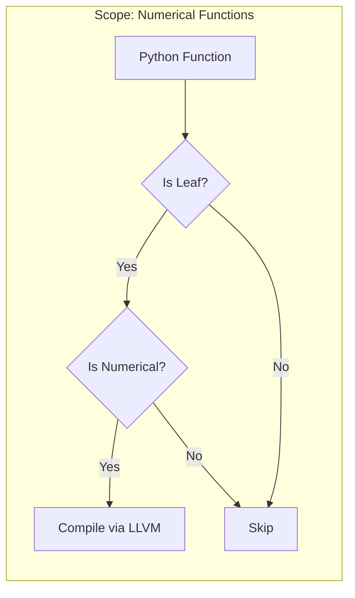
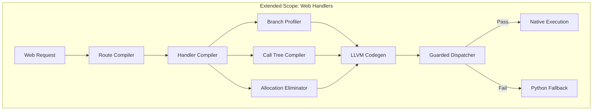

# PyAOT Vision: High-Performance Python Web Applications

> **Mission**: Make Python web applications approach native performance — bridging the gap from 1K to 1M requests per second.

---

## Problem Statement

### The Python Web Performance Gap

Python is the dominant language for web development (Django, Flask, FastAPI), yet suffers from a fundamental performance ceiling:

| Metric | Python (Flask/FastAPI) | Native (Rust/Go) | Gap |
|--------|------------------------|------------------|-----|
| Requests/sec (single core) | ~1,000-5,000 | ~100,000-500,000 | 20-100x |
| Latency (p99) | 5-50ms | 0.1-1ms | 10-50x |
| Memory per request | ~10-50KB | ~1-5KB | 10x |
| CPU utilization efficiency | 20-40% | 80-95% | 2-4x |

### Why This Matters

- **Cost**: Cloud bills scale linearly with inefficiency
- **Latency**: User experience degrades above 100ms  
- **Sustainability**: Energy waste at scale
- **Competitive pressure**: Teams migrating to Go/Rust for performance

### Root Causes

```
┌─────────────────────────────────────────────────────────────┐
│                  Python Web Request                         │
├─────────────────────────────────────────────────────────────┤
│  [100-200ns] × 50-100 function calls         = 5-20μs      │
│  [50ns] × 20-50 object allocations           = 1-5μs       │
│  [30ns] × 100+ attribute accesses            = 3-10μs      │
│  [500ns] exception handling setup            = 0.5μs       │
│  [variable] GIL contention                   = 0-1000μs    │
├─────────────────────────────────────────────────────────────┤
│  TOTAL INTERPRETER OVERHEAD PER REQUEST      = 10-1000μs   │
└─────────────────────────────────────────────────────────────┘
```

**Key insight**: Most webapp code is branching and data shuffling, not computation. The interpreter overhead dominates.

---

## What We Are Trying to Achieve

### Vision

> **Write Python. Run like C.**

Developers write idiomatic Python web applications. PyAOT profiles production traffic, identifies hot paths, and compiles entire request handlers to native code — transparently and safely.

### Goals

| Goal | Metric | Target |
|------|--------|--------|
| **Throughput** | Requests/sec | 10-100x improvement |
| **Latency** | P99 response time | 5-10x reduction |
| **Compatibility** | Python semantics | 100% preserved |
| **Developer experience** | Code changes required | Zero |
| **Safety** | Production crashes from compilation | Zero |

### Non-Goals

- Replacing CPython (we extend it)
- Compiling all Python code (only hot paths)
- Matching Rust/Go exactly (80% of performance with 100% Python)

---

## Constraints

### Technical Constraints

| Constraint | Implication |
|------------|-------------|
| CPython compatibility | Must work with standard Python, no forks |
| NumPy/Pandas ecosystem | Cannot break C extension interop |
| Existing codebases | No code modifications required |
| Production safety | Fallback to Python on any failure |
| Multi-framework | Flask, FastAPI, Django, Starlette |

### Architectural Constraints

| Constraint | Rationale |
|------------|-----------|
| Profile before compile | Cannot assume types without evidence |
| Guard all assumptions | Types can change at runtime |
| Preserve semantics | Same result as Python interpretation |
| Incremental adoption | Opt-in, per-route, per-handler |

### Resource Constraints

| Resource | Limit |
|----------|-------|
| Compilation overhead | < 5% of total startup time |
| Memory overhead | < 20% increase |
| Profiling overhead | < 5% in observation mode |
| Guard overhead | < 5% of compiled function time |

---

## Current Architecture

### PyAOT Today (v0.x)



**Current capabilities**:
- ✅ Compile pure numerical functions (`def f(x): return x * 2 + 1`)
- ✅ NumPy array operations
- ✅ SIMD vectorization
- ✅ Profile-guided type specialization

**Current limitations**:
- ❌ Only "leaf" functions (no function calls allowed)
- ❌ Only numerical types allowed
- ❌ No I/O, no ORM, no web frameworks
- ❌ No branch optimization
- ❌ No request handler compilation

### Gap Analysis

| Requirement | Current | Needed |
|-------------|---------|--------|
| Compile function calls | ❌ Leaf-only | ✅ Full call trees |
| Branch optimization | ❌ None | ✅ Profile-guided |
| String handling | ❌ Unsupported | ✅ Fast paths |
| Object attribute access | ⚠️ Shape guards | ✅ Inlined access |
| Route matching | ❌ Unsupported | ✅ Compiled trie |
| Database queries | ❌ Unsupported | ✅ Specialized deserializers |

---

## Proposed Architecture

### PyAOT Web (v1.0)



### New Subsystems

#### 1. Branch Profiler
Profile which branches are taken and with what frequency.

```python
# Input: profiling data showing
#   if user.is_admin: # True 95% of the time

# Output: LLVM IR with branch weights
br i1 %is_admin, label %hot, label %cold, !prof !{95, 5}
```

#### 2. Call Tree Compiler
Compile entire call chains, not just leaf functions.

```python
# Input
@app.route('/user/<id>')
def get_user(id):
    return serialize(db.get(User, id))

# Output: Single native function covering
#   - Route matching
#   - Parameter extraction  
#   - Database query
#   - Serialization
```

#### 3. Route Compiler
Compile URL routing to native state machines.

```python
# Input: Flask/FastAPI routes
# Output: Native trie traversal returning function pointers
```

#### 4. Allocation Eliminator
Eliminate per-request object allocations.

```python
# Before: 50 allocations per request
# After: Arena allocation, 0 GC pressure
```

### Extended Eligibility

| Current (Leaf-Only) | Proposed (Full Handler) |
|---------------------|-------------------------|
| No function calls | Traced function calls allowed |
| Numerical types only | Strings, dicts, objects allowed |
| No I/O | Profiled I/O patterns |
| No attribute access | Shape-guarded attribute access |

### Safety Guarantees (Unchanged)

All current safety guarantees remain:

1. **Semantic preservation**: Compiled code = Python behavior
2. **Guard safety**: Any assumption violation → Python fallback
3. **No crashes**: Fallback always available
4. **No data corruption**: Atomic transitions

---

## Comparison: Before and After

### Example: User API Endpoint

```python
@app.route('/api/user/<int:id>')
def get_user(id: int):
    if not current_user.is_authenticated:
        return {'error': 'Unauthorized'}, 401
    
    user = User.query.get(id)
    if not user:
        return {'error': 'Not found'}, 404
    
    return {
        'id': user.id,
        'name': user.name,
        'email': user.email,
    }
```

| Aspect | Before (Python) | After (PyAOT Web) |
|--------|-----------------|-------------------|
| Route matching | O(n) regex | Native jump table |
| `is_authenticated` check | 3 attr lookups | 1 guarded load |
| `User.query.get(id)` | ORM overhead | Specialized query |
| Dict construction | 4 allocations | Arena pre-alloc |
| JSON serialization | Reflection-based | Compiled serializer |
| **Total time** | ~500μs | ~5-50μs |

---

## Implementation Phases

### Phase 1: Branch Optimization (Foundation)
- Profile branch frequencies
- Emit LLVM branch weights
- **Impact**: 10-20% improvement

### Phase 2: Full Handler Compilation (Core)
- Relax leaf-only restriction
- Compile traced call trees
- **Impact**: 50-100% improvement

### Phase 3: Route & Allocation (Throughput)
- Native route compilation
- Arena allocation
- **Impact**: 100-200% improvement

### Phase 4: I/O Specialization (End-to-End)
- Query specialization
- Template compilation
- **Impact**: 50-100% improvement

### Phase 5: GIL Bypass (Scaling)
- Native code runs without GIL
- Multi-core parallelism
- **Impact**: 300-800% improvement (multi-core)

---

## Success Criteria

| Phase | Metric | Baseline | Target | Validation |
|-------|--------|----------|--------|------------|
| 1 | Branch-heavy benchmark | 1.0x | 1.2x | `bench_branching.py` |
| 2 | Handler latency | 500μs | 50μs | `wrk` benchmark |
| 3 | Requests/sec | 5K | 50K | TechEmpower-style |
| 4 | E2E latency | 10ms | 1ms | Production trace |
| 5 | Multi-core scaling | 1x | 8x | 8-core benchmark |

---

## Open Questions

1. **Framework priority**: Start with Flask, FastAPI, or Starlette?
2. **ORM support**: SQLAlchemy priority vs raw SQL?
3. **Deployment model**: JIT at startup vs pre-compiled artifacts?
4. **Observability**: How to expose compilation stats to users?

---

## References

- [TechEmpower Web Framework Benchmarks](https://www.techempower.com/benchmarks/)
- [io_uring and high-performance I/O](https://unixism.net/loti/)
- [LLVM Profile-Guided Optimization](https://llvm.org/docs/HowToBuildWithPGO.html)
- [GraalPython: AOT-compiled Python](https://github.com/graalvm/graalpython)
